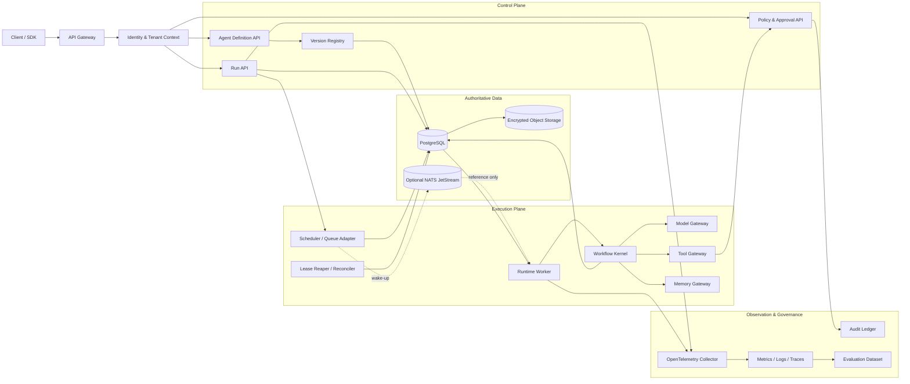
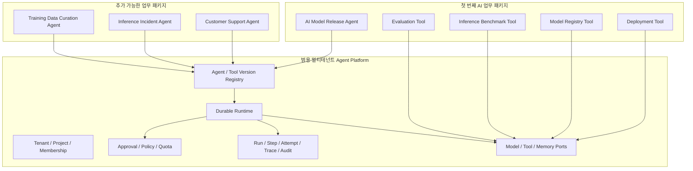
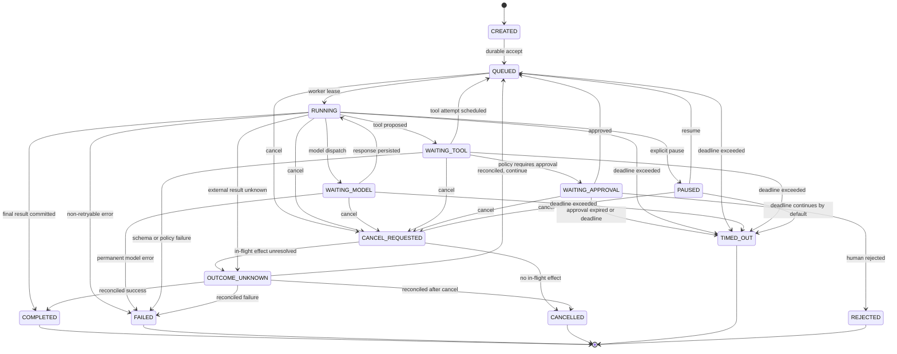
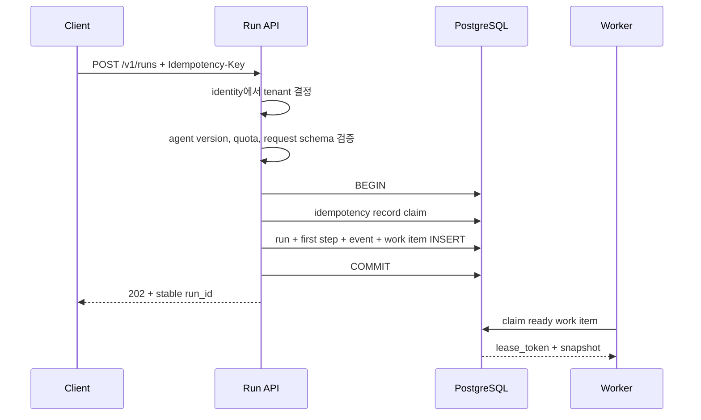
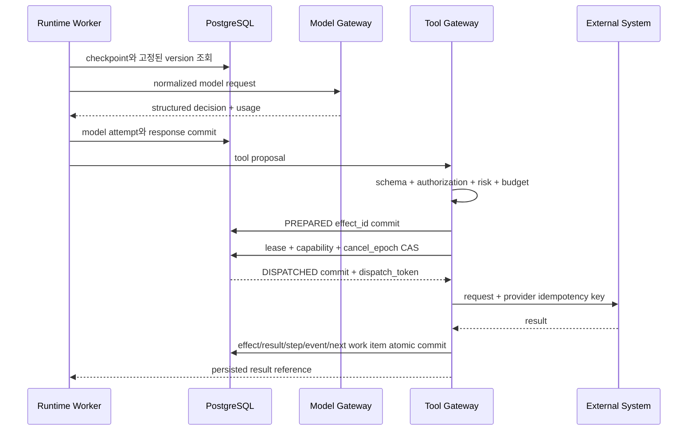
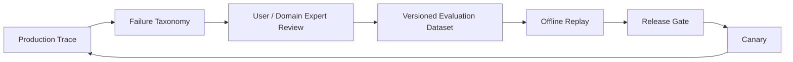

# Agent Runtime Platform 엔터프라이즈 설계

- 문서 상태: 구현 전 기준안
- 작성일: 2026-09-02
- 대상 범위: 멀티테넌트 Control Plane → 최소 Agent Runtime → 실행 신뢰성 → 추적·평가 → Model/Tool/Memory Gateway
- 기준 배포: 초기 Docker Compose, 이후 Kubernetes로 이전

## 1. 결론

이 플랫폼은 처음부터 여러 마이크로서비스로 나누지 않는다. 하나의 코드베이스 안에서 경계를 명확히 나눈 모듈러 모놀리스를 만들고, API 프로세스와 worker 프로세스만 물리적으로 분리한다.

핵심 결정은 다음과 같다.

1. **PostgreSQL을 실행 상태의 유일한 권위로 사용한다.**
2. **Run과 Step의 현재 상태 projection, append-only event, 작업 항목을 같은 트랜잭션에서 기록한다.**
3. **초기 작업 큐는 PostgreSQL `FOR UPDATE SKIP LOCKED`로 구현한다.**
4. **추후 NATS JetStream 같은 broker를 추가해도 메시지는 깨우기 신호로만 사용하고, worker는 항상 PostgreSQL 상태를 다시 확인한다.**
5. **API 모델과 mock model로 먼저 실행 주기를 완성하며 GPU·Kubernetes는 초기 범위에서 제외한다.**
6. **모델은 신뢰하지 않는 planner이며, Tool Gateway가 모든 외부 부작용의 유일한 정책 집행 지점이다.**
7. **전송은 at-least-once를 전제로 한다. 외부 도구의 exactly-once 실행을 주장하지 않는다.**
8. **agent, prompt, model policy, tool schema, authorization policy를 불변 버전으로 고정해 모든 Run을 재구성할 수 있게 한다.**
9. **원문 prompt·응답·tool 인자는 trace에 기본 저장하지 않는다. metadata와 암호화된 content reference를 분리한다.**
10. **자동 복구가 불가능한 외부 부작용은 실패로 단정하지 않고 `OUTCOME_UNKNOWN`으로 격리해 reconciliation 또는 사람의 판단으로 해결한다.**
11. **플랫폼 코어는 업무 중립적으로 유지하고, AI 모델 평가·배포는 Agent Definition과 Tool로 구성한 첫 번째 예제 패키지로 분리한다.**

이 구조의 목적은 Temporal이나 대규모 event platform을 다시 만드는 것이 아니다. 에이전트 실행에서 반드시 이해해야 하는 상태 전이, lease, checkpoint, 재시도, idempotency, 정책 집행, 추적을 제한된 범위에서 직접 구현하는 것이다.

## 2. 플랫폼이 최종 책임지는 실패

Agent Runtime Platform은 다음 실패를 최종적으로 소유한다.

| 실패 | 플랫폼 책임 |
| --- | --- |
| 요청을 받았지만 실행이 사라짐 | durable acceptance와 recovery |
| worker 장애 후 같은 tool이 중복 실행됨 | idempotency, fencing, reconciliation |
| 실행이 끝없이 반복됨 | step/token/time/cost budget |
| 어떤 model·prompt·tool로 실행했는지 모름 | immutable version과 trace |
| 취소했지만 새 부작용이 계속 발생함 | cancel gate와 dispatch 차단 |
| 다른 tenant의 memory·trace가 노출됨 | identity-derived tenant scope와 이중 격리 |
| 모델이 위험한 tool을 선택함 | deterministic policy와 human approval |
| 실패 원인을 평가 데이터로 재현하지 못함 | trace-to-evaluation lifecycle |

다음 영역은 이 저장소가 직접 소유하지 않는다.

- 모델 학습, fine-tuning, quantization
- vLLM/SGLang 내부 성능 튜닝
- GPU driver, Kubernetes cluster, CNI/CSI
- 업무별 도구 내부 비즈니스 로직

플랫폼은 이 기능들을 교체 가능한 gateway와 contract로 연결한다.

## 3. 설계 선택지 분석

### 3.1 Temporal 중심

Workflow와 Activity를 Temporal에 올리고 플랫폼은 agent definition, gateway, policy, trace를 담당한다.

장점:

- crash recovery, timer, retry, workflow history가 이미 검증되어 있다.
- 장기 실행과 human approval 대기에 강하다.
- 복잡한 workflow를 빠르게 운영할 수 있다.

단점:

- 실행 커널의 lease, replay, checkpoint 원리를 직접 구현하는 학습 범위가 줄어든다.
- Temporal cluster 운영과 SDK 제약이 새로운 핵심 의존성이 된다.
- 외부 tool side effect의 exactly-once는 여전히 별도 해결이 필요하다.

### 3.2 PostgreSQL 중심의 제한된 실행 커널 — 채택

Run, Step, Event, Lease, Idempotency, Approval, Usage를 PostgreSQL에 저장하고 별도 API/worker 프로세스가 실행한다.

장점:

- 상태 전이와 장애 복구 원리를 직접 증명할 수 있다.
- 단일 트랜잭션으로 Run, Event, 작업 생성을 묶을 수 있다.
- 초기 운영 구성과 장애 표면이 작다.
- 나중에 broker나 Temporal을 adapter 뒤에 추가할 수 있다.

단점:

- timer, fan-out, 장기 workflow, 대규모 history replay를 직접 제한해야 한다.
- 잘못 구현하면 자체 workflow engine이 끝없이 커질 수 있다.
- fault injection과 invariant test가 제품 기능만큼 중요해진다.

제한 원칙:

- DAG editor, 임의 DSL, multi-agent swarm은 초기 범위에서 제외한다.
- 하나의 Run은 순차 Step과 명시적 tool call만 지원한다.
- 병렬 fan-out은 reliability 단계가 통과한 뒤 별도 설계로 추가한다.
- 장기 timer가 핵심 요구가 되면 Temporal 도입을 다시 평가한다.

### 3.3 Kafka/event-stream 중심

모든 command와 event를 stream에 기록하고 projection을 구성한다.

장점:

- 높은 처리량, 다수 consumer, 장기 event 활용에 강하다.
- 분석·과금·평가 파이프라인으로 fan-out하기 쉽다.

단점:

- 초기 규모에서 partition ordering, schema evolution, replay 운영비가 과하다.
- 외부 부작용의 원자성 문제는 해결되지 않는다.
- 학습 초점이 agent runtime보다 streaming platform으로 이동한다.

Kafka는 일일 실행량, 독립 consumer 수, event 재처리 요구가 PostgreSQL/outbox 구조의 측정 한계를 넘을 때 도입한다.

## 4. 설계 원칙과 불변식

아래 항목은 구현 편의보다 우선한다.

1. **승인된 요청은 선언된 durability tier 안에서 유실되지 않는다.** API가 `202 Accepted`와 `run_id`를 반환하기 전에 Run과 최초 작업이 commit되어야 한다. process·worker·단일 host 장애는 RPO 0으로 견디고, 전체 region 재해는 배포가 공개한 RPO 범위로 구분한다.
2. **상태와 event는 갈라지지 않는다.** projection 변경과 `run_events` 추가는 항상 같은 transaction이다.
3. **정의는 실행 중 바뀌지 않는다.** Run은 `agent_version_id`, `model_policy_version`, `tool_version`, `policy_version`을 고정한다.
4. **메시지는 권위가 아니다.** 중복·지연·유실될 수 있으며 DB 상태와 fencing token이 실행 권한을 결정한다.
5. **외부 호출 중 DB lock을 잡지 않는다.** claim transaction은 짧게 끝내고 lease로 소유권을 표현한다.
6. **논리 Step과 물리 Attempt를 분리한다.** retry가 발생해도 같은 Step 아래 새로운 Attempt가 생성된다.
7. **terminal 상태는 되돌리지 않는다.** 이미 발생한 효과는 상태 rollback이 아니라 compensation으로 처리한다.
8. **모델 출력은 명령이 아니다.** schema 검증, authorization, risk policy를 통과해야 tool 실행 의도가 된다.
9. **승인은 정확한 효과에 묶인다.** tool version, 대상, 정규화한 인자 hash, policy version이 바뀌면 재승인한다.
10. **모호한 결과를 실패로 위장하지 않는다.** 외부 결과를 알 수 없으면 `UNKNOWN` 상태로 남긴다.
11. **trace와 audit은 목적이 다르다.** 성능·디버깅 trace와 보안 감사 원장을 별도로 보관한다.
12. **tenant는 클라이언트 입력이 아니다.** 인증된 identity에서 서버가 결정한다.

## 5. 논리 아키텍처



### 5.1 논리 경계와 초기 배포 단위

| 모듈 | 책임 | 초기 배포 |
| --- | --- | --- |
| Identity Context | 인증 결과에서 tenant, project, principal, workload identity 생성 | API |
| Definition Registry | agent·prompt·model/tool/policy 불변 버전 | API |
| Run API | 생성, 조회, stream, cancel, approve/reject | API |
| Workflow Kernel | 상태 머신, budget, next-step 결정 | worker |
| Scheduler | due 작업 claim과 dispatch | worker |
| Model Gateway | provider 차이 정규화, timeout, usage | worker |
| Tool Gateway | schema, authorization, approval, effect ledger | 별도 module, worker에서 호출 |
| Memory Gateway | session/long-term memory contract와 provenance | worker |
| Reconciler | lease 만료, UNKNOWN, DLQ 운영 | worker 또는 별도 process |
| Usage Ledger | token·tool·storage 비용 원장 | API/worker 공통 |
| Telemetry Adapter | OTel mapping, redaction, sampling | 공통 library |

처음에는 API와 worker 두 프로세스만 운영한다. Tool Gateway를 네트워크 서비스로 분리하는 시점은 독립 보안 경계, 별도 scaling, 다수 runtime의 공용 사용이 실제 요구될 때다.

### 5.2 플랫폼 코어와 업무 패키지 경계

플랫폼 코어는 범용 실행 기반만 소유한다. `Evaluation`, `Benchmark`, `Model Registry`, `Canary Deployment`는 코어 entity나 Step type이 아니라 등록된 Tool의 이름과 입출력 계약으로 표현한다.



경계 규칙은 다음과 같다.

- AI 모델 릴리스 패키지를 설치하지 않아도 플랫폼의 생성·실행·복구·추적 기능은 모두 동작해야 한다.
- 업무 패키지는 코어 table이나 상태 enum을 추가하지 않고 Agent Definition, Tool Version, Connection으로만 설치한다.
- `EVALUATION`, `BENCHMARK`, `CANARY_DEPLOYMENT` 같은 업무 동작은 `TOOL_CALL` Step의 tool identity로 표현한다.
- Phase 1의 공개 Step kind는 `MODEL_CALL`, `TOOL_CALL`로 제한하고, `APPROVAL`은 Phase 4의 정책 집행과 함께 활성화한다.
- durable timer가 검증된 뒤 `WAIT`를 추가하고, child Run의 권한·취소·비용 전파 계약이 정해질 때까지 `CHILD_AGENT`는 지원하지 않는다.
- `SYSTEM` 같은 포괄적 Step kind를 두지 않고 내부 제어 변화는 versioned Run Event로 기록한다.
- 업무별 adapter는 Gateway port를 구현하며 workflow kernel이나 Run projection을 직접 변경할 수 없다.

## 6. 실행 데이터 모델

### 6.1 핵심 entity

| Entity | 핵심 필드 | 규칙 |
| --- | --- | --- |
| `tenants` | `id, status, policy_set_id` | 모든 업무 데이터의 최상위 scope |
| `projects` | `id, tenant_id, name, status` | Agent·Tool·Run의 업무 경계 |
| `principals` | `id, tenant_id, issuer, subject, type, status` | 외부 IdP의 user/workload subject 매핑, credential 저장 금지 |
| `project_memberships` | `tenant_id, project_id, principal_id, role_set_id, status` | Project 접근 권한, 복합 FK로 tenant 일치 강제 |
| `connections` | `id, tenant_id, project_id, kind, config_ref, credential_ref, status` | provider 연결 metadata, secret은 외부 secret manager 참조만 저장 |
| `agent_definitions` | `id, tenant_id, project_id, name` | 업무 중립적인 이름과 소유권 |
| `agent_versions` | `id, tenant_id, project_id, definition_id, version, digest, spec` | publish 후 불변 |
| `tool_definitions` | `id, tenant_id, project_id, name` | Tool identity와 소유권 |
| `tool_versions` | `id, tenant_id, project_id, definition_id, version, schema_digest, risk_tier` | 입력·출력 schema와 실행 contract, publish 후 불변 |
| `policy_versions` | `id, tenant_id, project_id, version, digest, spec` | authorization·budget·approval 정책 snapshot |
| `runs` | `id, tenant_id, project_id, agent_version_id, state, state_version, deadline_at` | 현재 projection |
| `run_steps` | `id, tenant_id, run_id, ordinal, kind, state, attempt_count` | 논리 실행 단위 |
| `run_attempts` | `id, tenant_id, step_id, attempt_no, lease_token, started_at, ended_at` | 물리 실행 시도 |
| `run_events` | `tenant_id, run_id, sequence, schema_version, type, actor, payload_ref, occurred_at` | append-only, `UNIQUE(tenant_id, run_id, sequence)` |
| `checkpoints` | `tenant_id, run_id, step_id, continuation_ref, version` | 복구에 필수인 실행 상태 |
| `model_calls` | `tenant_id, step_id, attempt_id, provider, model, request_hash, response_ref, usage` | model 시도 단위 |
| `tool_calls` | `tenant_id, step_id, logical_call_index, tool_version_id, args_hash, risk_tier` | 모델이 제안한 논리 호출 |
| `tool_effects` | `tenant_id, effect_id, tool_call_id, status, provider_key, result_ref` | 외부 부작용 원장 |
| `approval_requests` | `id, tenant_id, effect_id, request_digest, state, expires_at` | digest가 바뀌면 무효 |
| `work_items` | `id, tenant_id, run_id, step_id, available_at, priority, lease_token, lease_expires_at` | authoritative queue |
| `idempotency_records` | `tenant_id, scope, key, request_hash, response_ref, expires_at` | key 재사용 충돌 방지 |
| `outbox_events` | `id, tenant_id, aggregate_id, type, payload_ref, published_at` | 외부 broker 추가 시 사용 |
| `usage_entries` | `id, tenant_id, project_id, run_id, step_id, source, quantity, unit, cost` | append-only 비용 원장 |
| `audit_events` | `event_id, tenant_id, project_id?, sequence, server_time, actor, subject, action, target, decision_id, result, trace_id, prev_hash, event_hash` | tenant 또는 Project 범위의 별도 보안 보존 정책 |

### 6.2 저장 전략

- 검색·상태 전이에 필요한 metadata는 PostgreSQL에 저장한다.
- 다음 Step을 결정하는 structured model decision, tool result, memory delta는 **실행 continuation payload**로 분류해 Run이 terminal 상태가 될 때까지 반드시 암호화해 내구 저장한다.
- 작은 continuation payload는 PostgreSQL에, 큰 payload와 첨부 파일은 암호화된 object storage에 저장하고 DB에는 content reference, hash, 분류 등급을 둔다.
- raw secret은 DB, queue, checkpoint, DLQ, trace, object payload 어디에도 저장하지 않는다.
- 관측·분석용 raw prompt와 응답 저장은 tenant 정책에 따라 꺼질 수 있다. 실행 continuation payload는 telemetry content와 별도이며 복구에 필요한 기간 동안 비활성화할 수 없다.
- terminal 이후 continuation payload는 tenant retention 정책에 따라 축약·삭제할 수 있고, 장기 trace에는 metadata와 허용된 content만 남긴다.
- `run_events`는 실행 복구와 감사의 입력이지만, 보안 audit ledger를 대신하지 않는다.
- 삭제 요청은 Run만 지우지 않고 checkpoint, content, memory, embedding, cache, evaluation 후보까지 추적해 처리한다.

모든 tenant 소유 실행 table은 직접 `tenant_id`를 가진다. surrogate ID가 있는 table에는 `(tenant_id, id)` unique key를 두고, 관계는 tenant를 포함한 composite foreign key로 연결한다. Project 소유 최상위 entity는 `project_id`도 직접 가지며 `(tenant_id, project_id)` 관계를 검증한다. tenant 없는 자식 row가 생성되거나 다른 tenant 부모를 참조하는 것을 database constraint로 차단한다.

인증과 계정 lifecycle의 권위는 외부 identity provider에 둔다. `principals`는 인증서·비밀번호를 보관하는 사용자 table이 아니라 검증된 issuer와 subject를 로컬 권한에 매핑하는 projection이다. `connections`에도 credential 원문을 넣지 않고 Tool Gateway가 실행 직전에 해석할 수 있는 secret reference만 저장한다.

Project는 Tenant 안의 협업·권한·비용 경계다. Run 생성 시 서버는 인증된 principal의 활성 membership을 확인해 `tenant_id`와 `project_id`를 결정하며, 클라이언트가 임의로 보낸 scope를 신뢰하지 않는다. 실행 자식 row는 Run의 scope와 다른 Project를 참조할 수 없다.

## 7. Run과 Step 상태 머신



상태 변경 권한을 분리한다.

- API: `CREATED → QUEUED`, cancel 요청, pause/resume 요청, approval 결정
- worker: 실행 관련 전이와 terminal 결과
- reconciler: lease 만료 재할당, `OUTCOME_UNKNOWN` 조정, DLQ 격리
- 운영자: 직접 SQL update가 아니라 관리 API를 통한 재처리·종료

모든 전이는 `state_version`을 이용한 optimistic concurrency 또는 짧은 row lock으로 직렬화한다. 허용되지 않은 이전 상태에서 update가 발생하면 성공으로 덮어쓰지 않고 conflict event로 남긴다.

### 7.1 상태 전이 계약

다이어그램은 요약이며 구현의 권위는 아래 형식의 versioned transition registry다.

| Event | 허용 이전 상태 | Guard | Owner | 같은 transaction에 기록 | 결과 |
| --- | --- | --- | --- | --- | --- |
| `RUN_ACCEPTED` | 없음 | agent version 활성, quota 허용 | API | Run, first Step, Event, Work Item | `QUEUED` |
| `WORK_CLAIMED` | `QUEUED` | due, current lease 없음 | worker | Attempt, lease, Event | `RUNNING` |
| `MODEL_DISPATCHED` | `RUNNING` | cancel gate 통과, budget 잔여 | worker | Model Attempt, Event | `WAITING_MODEL` |
| `MODEL_RECORDED` | `WAITING_MODEL` | current lease, schema 유효 | worker | response/continuation, usage, Event | `RUNNING` |
| `TOOL_PROPOSED` | `RUNNING` | tool version 고정, args 유효 | worker | Tool Call, policy request, Event | `WAITING_TOOL` |
| `TOOL_AUTO_SCHEDULED` | `WAITING_TOOL` | policy 허용, approval 불필요 | Tool Gateway | Work Item, Event | `QUEUED` |
| `APPROVAL_REQUIRED` | `WAITING_TOOL` | risk policy 요구 | Tool Gateway | Approval Request, Audit, Event | `WAITING_APPROVAL` |
| `APPROVAL_GRANTED` | `WAITING_APPROVAL` | digest·identity·expiry 유효 | Approval API | Approval evidence, Work Item, Event | `QUEUED` |
| `APPROVAL_REJECTED` | `WAITING_APPROVAL` | 승인 주체 유효 | Approval API | rejection reason, Audit, Event | `REJECTED` |
| `APPROVAL_EXPIRED` | `WAITING_APPROVAL` | platform clock ≥ approval expiry | reconciler | expiration reason, Audit, Event | `TIMED_OUT` |
| `RETRY_SCHEDULED` | `RUNNING, WAITING_MODEL, WAITING_TOOL` | retryable, budget 잔여, active Effect 없음 | worker | failed Attempt, next Attempt/Work Item, Event | `QUEUED` |
| `PAUSE_REQUESTED` | non-terminal | Run state version 일치 | API | pause flag, Event | 현재 상태 유지 |
| `RUN_PAUSED` | `QUEUED, RUNNING` | safe checkpoint, dispatched Effect 없음 | worker | Checkpoint, Event | `PAUSED` |
| `RUN_RESUMED` | `PAUSED` | deadline·policy 유효 | API | Work Item, Event | `QUEUED` |
| `CANCEL_LINEARIZED` | non-terminal | current state version | API | cancel epoch 증가, lease fencing, Event | `CANCEL_REQUESTED` |
| `CANCEL_COMPLETED` | `CANCEL_REQUESTED` | 모든 in-flight Effect 결과 확인 | worker/reconciler | cancellation outcome, Event | `CANCELLED` |
| `CANCEL_EFFECT_UNKNOWN` | `CANCEL_REQUESTED` | in-flight Effect 결과 증명 불가 | Tool Gateway | Effect status, reconciliation item, Event | `OUTCOME_UNKNOWN` |
| `EFFECT_UNKNOWN` | `RUNNING` | 외부 결과 증명 불가 | Tool Gateway | Effect status, reconciliation item, Event | `OUTCOME_UNKNOWN` |
| `RECONCILED_CONTINUE` | `OUTCOME_UNKNOWN` | 결과 확인, cancel epoch 미변경 | reconciler | Effect result, Work Item, Event | `QUEUED` |
| `RECONCILED_AFTER_CANCEL` | `OUTCOME_UNKNOWN` | 결과·보상 확인, cancel 요청 존재 | reconciler | cancellation outcome, Event | `CANCELLED` |
| `RUN_COMPLETED` | `RUNNING` | final result durable, no pending effect | worker | result, usage, Event | `COMPLETED` |
| `RUN_FAILED` | non-terminal | non-retryable, active Effect 없음 | worker/reconciler | error taxonomy, Event | `FAILED` |
| `DEADLINE_EXCEEDED` | non-terminal | platform clock ≥ deadline, active Effect 없음 | worker/reconciler | error taxonomy, Event | `TIMED_OUT` |
| `DEADLINE_WITH_INFLIGHT` | non-terminal | deadline 초과, DISPATCHED Effect 존재 | reconciler | reconciliation item, Event | `OUTCOME_UNKNOWN` |

Step, Attempt, Effect의 상태는 Run 상태와 별도로 관리한다.

| Entity | Event | 이전 상태 | Guard와 같은 transaction 기록 | Owner | 결과 |
| --- | --- | --- | --- | --- | --- |
| Step | `STEP_CREATED` | 없음 | ordinal unique, Step/Event | kernel | `PENDING` |
| Step | `STEP_READY` | `PENDING` | dependency 완료, Work Item/Event | kernel | `READY` |
| Step | `STEP_STARTED` | `READY` | current lease, Attempt/Event | worker | `RUNNING` |
| Step | `STEP_APPROVAL_WAIT` | `RUNNING` | Approval Request/Event | Tool Gateway | `WAITING_APPROVAL` |
| Step | `STEP_RETRY` | `RUNNING, OUTCOME_UNKNOWN` | retry budget, 새 Work Item/Event | worker/reconciler | `READY` |
| Step | `STEP_RECONCILED_SUCCEEDED` | `OUTCOME_UNKNOWN` | provider success evidence/result/Event | reconciler | `SUCCEEDED` |
| Step | `STEP_RECONCILED_FAILED` | `OUTCOME_UNKNOWN` | provider failure evidence/error/Event | reconciler | `FAILED` |
| Step | `STEP_RECONCILED_CANCELLED` | `OUTCOME_UNKNOWN` | cancel 존재, effect 결과·보상 확인/Event | reconciler | `CANCELLED` |
| Step | `STEP_SUCCEEDED` | `RUNNING` | durable result, usage/Event | worker | `SUCCEEDED` |
| Step | `STEP_FAILED` | `RUNNING` | non-retryable error/Event | worker | `FAILED` |
| Step | `STEP_CANCELLED` | `PENDING, READY, RUNNING, WAITING_APPROVAL` | cancel epoch, DISPATCHED Effect 없음/Event | worker/reconciler | `CANCELLED` |
| Step | `STEP_SKIPPED` | `PENDING, READY` | branch decision/Event | kernel | `SKIPPED` |
| Step | `STEP_EFFECT_UNKNOWN` | `RUNNING` | Effect/reconciliation/Event | Tool Gateway | `OUTCOME_UNKNOWN` |
| Attempt | `ATTEMPT_CREATED` | 없음 | attempt_no unique/Attempt | worker | `CREATED` |
| Attempt | `ATTEMPT_LEASED` | `CREATED` | current lease token/Attempt Event | worker | `LEASED` |
| Attempt | `ATTEMPT_DISPATCHED` | `LEASED` | provider request metadata/Event | Gateway | `DISPATCHED` |
| Attempt | `ATTEMPT_SUCCEEDED` | `DISPATCHED` | durable result/usage/Event | Gateway | `SUCCEEDED` |
| Attempt | `ATTEMPT_FAILED` | `LEASED, DISPATCHED` | classified error/Event | worker/Gateway | `FAILED` |
| Attempt | `ATTEMPT_ABANDONED` | `LEASED` | lease expiry, 외부 dispatch 없음/Event | reconciler | `ABANDONED` |
| Attempt | `ATTEMPT_OUTCOME_UNKNOWN` | `DISPATCHED` | lease expiry, provider 결과 증명 불가/Event | reconciler | `OUTCOME_UNKNOWN` |
| Attempt | `ATTEMPT_RECONCILED` | `OUTCOME_UNKNOWN` | provider evidence/Event | reconciler | `SUCCEEDED` 또는 `FAILED` |
| Attempt | `ATTEMPT_STALE` | `LEASED, DISPATCHED` | fencing CAS 실패/Event | worker | `STALE` |
| Effect | `EFFECT_PREPARED` | 없음 | effect_id·args hash unique/Effect | Tool Gateway | `PREPARED` |
| Effect | `EFFECT_CANCELLED` | `PREPARED` | cancel 선형화가 먼저 commit/Event | Tool Gateway | `CANCELLED` |
| Effect | `EFFECT_DISPATCH_LINEARIZED` | `PREPARED` | lease·capability·cancel_epoch CAS, dispatch token/Event | Tool Gateway | `DISPATCHED` |
| Effect | `EFFECT_SUCCEEDED` | `DISPATCHED` | provider evidence/result/Event | Tool Gateway | `SUCCEEDED` |
| Effect | `EFFECT_FAILED` | `DISPATCHED` | authoritative failure/Event | Tool Gateway | `FAILED` |
| Effect | `EFFECT_UNKNOWN` | `DISPATCHED` | 결과 증명 불가/reconciliation/Event | Tool Gateway | `OUTCOME_UNKNOWN` |
| Effect | `EFFECT_RECONCILED` | `OUTCOME_UNKNOWN` | provider evidence/Event | reconciler | `SUCCEEDED` 또는 `FAILED` |
| Effect | `COMPENSATION_SCHEDULED` | `SUCCEEDED` | original reference, 승인, Work Item/Event | operator/policy | `COMPENSATION_REQUIRED` |
| Effect | `EFFECT_COMPENSATED` | `COMPENSATION_REQUIRED` | compensation provider evidence/Event | Tool Gateway | `COMPENSATED` |

approval expiry는 `TIMED_OUT`, 사람의 명시적 거절은 `REJECTED`로 구분한다. pause 상태에서도 deadline은 기본적으로 흐르며, deadline을 멈추는 별도 정책은 초기 범위에서 지원하지 않는다.

Run terminal transition의 guard는 관련 projection 정리를 포함한다.

- Step terminal 집합은 `SUCCEEDED, FAILED, CANCELLED, SKIPPED`다. `OUTCOME_UNKNOWN`은 terminal이 아니다.
- Attempt terminal 집합은 `SUCCEEDED, FAILED, ABANDONED, STALE`다. `OUTCOME_UNKNOWN`은 reconciliation 전까지 terminal이 아니다.
- Effect terminal 집합은 `SUCCEEDED, FAILED, CANCELLED, COMPENSATED`다. `OUTCOME_UNKNOWN, COMPENSATION_REQUIRED`는 terminal이 아니다.
- `COMPLETED`는 모든 필수 Step이 `SUCCEEDED/SKIPPED`이고 모든 Attempt·Effect가 terminal일 때만 허용한다.
- `FAILED, REJECTED, TIMED_OUT, CANCELLED` 전이 transaction은 남은 `PENDING/READY/WAITING_APPROVAL` Step을 `SKIPPED/CANCELLED`로, 외부 dispatch가 없는 Attempt를 `ABANDONED`로 함께 정리한다.
- DISPATCHED 또는 UNKNOWN Attempt·Effect가 하나라도 있으면 Run을 terminal로 만들지 않고 `OUTCOME_UNKNOWN` 또는 `CANCEL_REQUESTED`에서 reconciliation을 계속한다.

## 8. 핵심 실행 흐름

### 8.1 Run 생성



같은 idempotency key와 같은 request hash가 다시 오면 최초 응답을 반환한다. 같은 key에 다른 hash가 오면 `409 Conflict`로 거절한다.

### 8.2 Model 판단과 Tool 실행



model response가 이미 저장되어 있으면 crash recovery 과정에서 같은 판단을 다시 호출하지 않는다. 응답을 받기 전에 연결이 끊겼다면 기존 attempt를 `UNKNOWN` 또는 retryable error로 기록하고, 새 attempt를 명시적으로 생성한다. 이 경우 추가 비용과 비결정성이 발생했음을 usage와 trace에 남긴다.

## 9. Durable Execution

### 9.1 작업 claim과 fencing

초기 worker는 다음 개념으로 ready 작업을 claim한다.

1. `FOR UPDATE SKIP LOCKED`로 due work item을 짧게 잠근다.
2. 단조 증가하는 `lease_token`과 `lease_expires_at`을 발급한다.
3. transaction을 즉시 commit한다.
4. model/tool 호출은 lock 없이 수행한다.
5. 결과 저장은 현재 `lease_token`이 일치할 때만 허용한다.
6. 늦게 돌아온 이전 worker의 결과는 stale attempt로 기록하고 projection에는 반영하지 않는다.

heartbeat는 lease를 연장할 뿐 이미 발생한 외부 효과를 취소하거나 되돌리지 못한다.

### 9.2 retry 분류

| 분류 | 예시 | 정책 |
| --- | --- | --- |
| Transient | timeout, 429, 일시적 5xx | 제한된 exponential backoff + jitter |
| Capacity | queue saturation, provider quota | admission control 또는 다른 tier로 지연 |
| Invalid | schema 불일치, 없는 tool | 재시도 없이 실패 |
| Policy Denied | 권한·risk policy 거절 | 실패 또는 approval 대기 |
| Deadline | Run/Step deadline 초과 | `TIMED_OUT` |
| Unknown Effect | 외부 요청 결과 불명 | 자동 blind retry 금지, reconciliation |
| Poison Work | 반복적으로 같은 내부 오류 | 유한 attempt 후 DLQ |

retry budget은 max attempts만 보지 않고 남은 deadline, token budget, cost budget, provider rate limit을 함께 검사한다.

### 9.3 cancellation

- cancel의 선형화 지점은 Run을 `CANCEL_REQUESTED`로 바꾸고 `cancel_epoch`을 증가시키며 현재 lease를 fencing하는 database commit이다.
- Tool Gateway의 dispatch 선형화 지점은 `tool_effects PREPARED → DISPATCHED`를 current lease, capability, deny overlay, `cancel_epoch` 조건으로 CAS하고 `dispatch_token`을 기록하는 database commit이다.
- cancel과 dispatch는 같은 Run/Effect guard를 갱신하므로 순서가 DB에서 결정된다. cancel commit이 먼저면 dispatch CAS가 실패한다. dispatch commit이 먼저면 이후 network send가 취소 commit 뒤에 발생하더라도 해당 Effect는 이미 **in-flight**로 분류된다.
- network send와 DB commit 자체를 하나의 원자적 작업으로 표현하지 않는다. 보장하는 것은 cancel 선형화 이후 새로운 `PREPARED → DISPATCHED` 전이가 0건이라는 것이다.
- in-flight effect는 성공, 실패, compensation 완료, `OUTCOME_UNKNOWN` 중 하나로 증명될 때까지 추적한다.
- 진행 중인 provider call에는 가능한 경우 취소 신호를 전달한다.
- 이미 commit된 외부 효과는 cancel로 되돌리지 않고 별도 compensation command를 생성한다.
- 승인 대기 중 cancel되면 approval token을 즉시 무효화한다.
- stale worker가 cancel 후 결과를 commit하지 못하도록 fencing token을 변경한다.
- `CANCELLED`는 새 `DISPATCHED` 전이가 차단되고 모든 in-flight effect의 결과 또는 compensation이 확인된 뒤에만 기록한다.
- 취소 응답에는 `NO_EFFECT`, `EFFECT_SUCCEEDED`, `COMPENSATED` 중 하나의 cancellation outcome을 남겨 호출자가 취소 전에 발생한 효과를 숨김없이 확인할 수 있게 한다.

### 9.4 checkpoint와 replay

checkpoint에는 다음 Step을 결정할 수 있는 최소 상태만 저장한다.

- 고정된 agent/model/tool/policy version
- 완료된 Step과 결과 reference
- 남은 budget과 deadline
- memory snapshot/version reference
- 다음 transition

자동 recovery는 저장된 model/tool 결과를 재사용한다. 디버깅용 replay는 원본 기록을 읽는 `dry replay`와 실제 provider를 다시 부르는 `active replay`를 분리하고, active replay는 새로운 Run으로 생성한다.

## 10. 외부 Tool 부작용 안전성

### 10.1 효과 식별

모든 쓰기 도구는 호출 전에 안정적인 `effect_id`를 만든다.

```text
effect_id = hash(
  tenant_id,
  run_id,
  logical_step_id,
  tool_version_id,
  logical_call_index
)
```

정규화한 인자 hash를 함께 저장한다. 동일 `effect_id`에 다른 인자가 들어오면 실행을 거절한다.

### 10.2 도구 효과 등급

| 효과 유형 | 조건 | 자동 retry |
| --- | --- | --- |
| `READ_ONLY` | 외부 상태 변경 없음 | 허용 |
| `PROVIDER_IDEMPOTENT` | provider가 key 기반 중복 제거·결과 조회 지원 | 동일 key로 허용 |
| `RECONCILABLE` | 고유 reference로 상태 조회 가능 | 조회 후 결정 |
| `COMPENSATABLE` | 되돌리는 명시적 API와 정책 존재 | provider dedupe 또는 결과 확인 후에만 허용 |
| `NON_IDEMPOTENT` | key·조회·보상 모두 없음 | 금지, 자동 retry 없이 수동 조정 |

사람의 승인은 위험한 작업을 **허가**할 뿐 replay를 안전하게 만들지 않는다. compensation의 존재도 첫 시도의 성공 여부를 증명하지 않는다. 자동 retry는 provider의 문서화된 중복 제거 기간 안에서 같은 key를 사용하거나, authoritative status 조회로 첫 결과를 확인한 뒤에만 허용한다. compensation은 원 effect의 provider reference와 attempt correlation이 확인된 뒤 별도 effect로 실행한다.

### 10.3 “도구 성공 직후 worker 종료” 처리

| 장애 지점 | 복구 |
| --- | --- |
| 외부 요청 전 종료 | lease 만료 후 재시도 |
| provider 성공 후 로컬 commit 전 종료 | 같은 provider key로 재호출하거나 status 조회 |
| 로컬 commit 후 queue ACK 전 종료 | 재배달 worker가 `SUCCEEDED`를 읽고 실행 없이 ACK |
| 요청 전송 후 응답 유실 | `OUTCOME_UNKNOWN`, provider 조회 |
| provider가 key와 조회를 지원하지 않음 | 자동 retry 금지, `UNKNOWN_REQUIRES_RECONCILIATION` |

DB와 외부 시스템 사이에는 하나의 원자적 transaction이 없다. 따라서 provider 지원 없이 exactly-once effect를 보장한다는 표현은 사용하지 않는다.

`EFFECT_DISPATCH_LINEARIZED` commit 후 process가 network send 전에 종료될 수도 있다. provider idempotency를 지원하면 같은 key로 안전하게 전송을 재개하고, 지원하지 않으면 실제 전송 여부를 알 수 없으므로 blind retry 없이 `OUTCOME_UNKNOWN`으로 보낸다.

## 11. Gateway 계약

### 11.1 Model Gateway

플랫폼은 provider SDK를 직접 workflow kernel에 노출하지 않는다.

입력:

- provider route와 model policy version
- messages/content reference
- tool schema version 목록
- structured output schema
- timeout, token, cost budget
- trace context와 stable attempt id

출력:

- 정규화한 text 또는 structured decision
- provider response id와 실제 model version
- finish reason
- input/output/cache/reasoning token usage
- latency와 time-to-first-token/chunk
- raw response content reference

provider failover는 무조건 재호출하지 않는다. 원 provider 결과가 불명확하면 비용·비결정성을 기록한 뒤 policy가 허용할 때만 새 attempt로 다른 provider를 호출한다.

### 11.2 Tool Gateway

Tool Gateway는 다음 순서를 우회할 수 없게 한다.

1. 등록된 불변 tool version 조회
2. JSON Schema 검증과 canonicalization
3. tenant/user/workload identity 확인
4. 대상·action·인자·risk tier·budget에 대한 authorization
5. approval 필요 여부 결정
6. effect ledger와 provider idempotency key 생성
7. 짧은 수명의 credential 주입
8. sandbox/egress 정책 아래 실행
9. 결과 schema 검증과 secret/PII redaction
10. effect, audit, trace 기록

### 11.3 Memory Gateway

초기 memory는 두 종류로 제한한다.

- Session memory: 한 Run 또는 conversation 안에서만 사용
- Long-term memory: 명시적 write policy, provenance, TTL, 삭제 경로가 있는 데이터

memory 결과는 instruction이 아니라 비신뢰 context다. tenant filter는 검색 후 필터링하지 않고 query 자체에 포함한다. memory write도 tool과 같은 권한 있는 작업으로 취급한다.

## 12. API 계약

### 12.1 Run 생성

```http
POST /v1/runs
Authorization: Bearer <token>
Idempotency-Key: 7bd45e25-...
Content-Type: application/json
```

```json
{
  "agent_version_id": "av_01...",
  "input": {
    "type": "text",
    "content": "요청 내용"
  },
  "execution": {
    "deadline_seconds": 300,
    "max_steps": 12,
    "max_input_tokens": 50000,
    "max_output_tokens": 12000,
    "max_cost": {
      "currency": "USD",
      "amount": "2.00"
    }
  }
}
```

응답은 durable commit 이후에만 반환한다.

서버는 `agent_version_id`의 소유 Project와 인증된 principal의 활성 Membership을 대조해 실행 scope를 결정한다. `tenant_id`나 `project_id`를 request body로 받아 권한 판단에 사용하지 않는다.

```json
{
  "run_id": "run_01...",
  "project_id": "project_01...",
  "state": "QUEUED",
  "agent_version_id": "av_01...",
  "created_at": "2026-09-01T00:00:00Z"
}
```

### 12.2 필수 endpoint

| Method | Path | 용도 |
| --- | --- | --- |
| `POST` | `/v1/runs` | idempotent Run 생성 |
| `GET` | `/v1/runs/{run_id}` | 현재 projection 조회 |
| `GET` | `/v1/runs/{run_id}/events` | sequence 기반 event 조회 |
| `GET` | `/v1/runs/{run_id}/stream` | SSE 기반 상태·출력 stream |
| `POST` | `/v1/runs/{run_id}/cancel` | durable cancel 요청 |
| `POST` | `/v1/runs/{run_id}/pause` | 명시적 pause |
| `POST` | `/v1/runs/{run_id}/resume` | pause된 Run 재개 |
| `POST` | `/v1/approvals/{id}/approve` | digest에 묶인 승인 |
| `POST` | `/v1/approvals/{id}/reject` | 승인 거절 |
| `POST` | `/v1/agents/{id}/versions` | 불변 agent version 생성 |

SSE 연결이 끊겨도 실행은 계속된다. 클라이언트는 마지막 event sequence로 재연결할 수 있어야 한다.

## 13. 보안과 멀티테넌시

### 13.1 신뢰 경계

다음 데이터는 모두 비신뢰 입력이다.

- 사용자 메시지
- 웹·문서·이메일·RAG 결과
- tool response
- memory
- 다른 agent의 출력
- model의 plan과 structured output

system prompt에 secret이나 authorization 규칙을 넣지 않는다. model이 “허용됨”이라고 말해도 권한 근거가 되지 않는다.

### 13.2 Tool authorization

- 기본 거부와 최소 권한을 적용한다.
- `user + workload identity + tenant + tool/action + target + args digest + risk tier + budget`을 매 호출마다 다시 평가한다.
- sub-agent와 연쇄 호출에서도 원 사용자의 on-behalf-of identity를 유지한다.
- 허용 결과는 run, step, target, args hash, policy version, expiry에 묶인 일회성 capability로 표현한다.
- 실행 직전에 다시 검사해 승인 후 인자 변경과 TOCTOU를 차단한다.
- Run에 고정한 policy version은 재현용 snapshot이다. tenant 정지, 사용자 권한 철회, tool 비활성화, credential 폐기, emergency kill switch를 담는 **현재 deny overlay**를 매 dispatch 직전에 fail-closed로 평가하며 snapshot보다 항상 우선한다.
- trace와 audit에는 고정 policy version, 현재 deny overlay version, decision ID를 함께 기록한다.

### 13.3 위험 등급과 승인

| 등급 | 예시 | 정책 |
| --- | --- | --- |
| T0 | 공개 데이터 읽기, 내부 read-only query | policy 통과 후 자동 |
| T1 | 되돌릴 수 있는 내부 변경 | tenant policy에 따라 자동 또는 승인 |
| T2 | 외부 메시지, 배포, 금전·계정 상태 변경 | 명시적 승인 |
| T3 | 임의 코드, 관리자 권한, secret·보안 설정 변경 | 기본 거부, 강한 sandbox와 maker-checker |

승인 화면은 model 요약이 아니라 실제 대상, 최종 인자, 예상 부작용, rollback 가능성을 보여준다. 인자나 policy가 바뀌면 기존 승인은 무효다.

### 13.4 secret과 sandbox

- Tool Gateway가 authorization 후 외부 secret manager에서 짧은 수명 credential을 가져온다.
- credential은 실행기에만 주입하며 model context와 queue payload에는 넣지 않는다.
- lease 상실, cancel, Run 종료 시 credential을 폐기한다.
- code/shell 도구는 API·worker와 다른 임시 sandbox에서 실행한다.
- non-root, read-only root filesystem, capability drop, seccomp, 자원 제한을 기본으로 한다.
- egress는 default deny이며 승인된 proxy와 destination allowlist를 통과한다.
- localhost, private/link-local network, cloud metadata endpoint, DNS rebinding을 차단한다.

### 13.5 Tenant·Project 격리

- `tenant_id`는 인증 결과에서 생성하고 모든 DB row, cache key, object path, queue reference, trace, memory에 강제한다.
- `project_id`는 Agent Version의 소유 Project와 활성 Membership에서 결정하며 request body의 임의 scope를 권한 근거로 사용하지 않는다.
- Agent·Tool·Policy·Connection·Run의 Project 관계는 application authorization과 composite foreign key로 모두 검증한다.
- 애플리케이션 query 조건에 더해 PostgreSQL Row-Level Security를 두 번째 방어층으로 사용한다.
- 일반 application DB role은 `BYPASSRLS`나 table owner 권한을 갖지 않는다.
- global dispatcher는 payload를 읽을 수 없는 전용 no-login owner의 `SECURITY DEFINER` claim function만 호출한다. 함수는 제한된 work metadata와 tenant ID를 반환하며 `search_path`를 고정하고 호출자 입력으로 임의 SQL을 만들지 않는다.
- worker는 claim 후 각 transaction에서 `SET LOCAL app.tenant_id`를 설정하고 해당 tenant RLS 아래에서 실행 데이터를 읽고 쓴다. dispatcher 권한을 workflow나 tool 실행에 전달하지 않는다.
- cache/vector index는 tenant query filter를 강제하고 고감도 tenant는 별도 namespace·key·index를 사용한다.
- quota, concurrency, token, cost budget을 tenant 단위로 집행한다.
- 다른 Tenant 또는 같은 Tenant의 권한 없는 Project에 속한 run ID·connection·approval token·queue message·cache key·trace를 대입하는 canary test를 CI에 둔다.

### 13.6 보안 감사 원장

- audit event는 전역 고유 event ID, tenant 내 단조 sequence, server timestamp, actor, on-behalf-of subject, workload identity, action, target, redacted args/result hash, policy/overlay version, decision ID, approval evidence, credential grant ID, trace/span ID를 가진다.
- application role에는 `INSERT`만 허용하고 `UPDATE/DELETE`는 금지한다.
- tenant partition별 `prev_hash/event_hash`로 순서를 검증하고 export batch를 서명한다.
- 운영 DB와 별개로 Object Lock/WORM이 가능한 저장소에 지속 export한다.
- audit sink 장애 시 T2/T3 작업은 fail-closed한다. T0/T1은 정책이 허용한 경우에만 암호화된 local spool을 사용하는 명시적 degraded mode로 동작하며 경보를 발생시킨다.
- 보존 기간, legal hold, tenant export/delete 예외는 데이터 등급과 규제 정책으로 관리한다.

## 14. 관측성, 감사, 평가

### 14.1 trace 구조

```text
HTTP POST /v1/runs
└─ enqueue run
   ... async trace link ...
   process run attempt
   └─ invoke_agent
      ├─ chat model
      ├─ execute_tool
      │  └─ HTTP / DB / RPC
      └─ memory read/write
```

물리 retry마다 새 span을 만들고 durable 식별자로 연결한다.

- `agent.platform.run.id`
- `agent.platform.tenant.id_hash`
- `agent.platform.project.id_hash`
- `agent.platform.step.id`
- `agent.platform.attempt.number`
- `agent.platform.lease.id`
- `agent.platform.checkpoint.id`
- `agent.platform.agent.version`
- `agent.platform.policy.version`
- `agent.platform.tool_schema.version`
- `agent.platform.model_route`

OpenTelemetry GenAI semantic conventions는 아직 Development 상태이므로 해당 이름을 DB schema에 직접 결합하지 않는다. version을 고정한 Telemetry Adapter가 내부 필드를 OTel 속성으로 변환한다.

### 14.2 민감정보 정책

- prompt, system instruction, model output, tool args/result, memory 원문 수집은 기본 비활성화한다.
- trace에는 content reference, hash, size, classification, redaction policy version을 기록한다.
- 명시적으로 허용된 환경과 tenant에서만 원문 수집을 opt-in한다.
- baggage에는 credential, API key, PII를 넣지 않는다.
- chain-of-thought 원문은 저장하지 않는다. 애플리케이션이 만든 decision summary와 reasoning token 수만 허용한다.
- 실패·정책 위반·고위험 tool Run은 metadata trace를 100% 보존하고 일반 성공은 sampling한다.

### 14.3 운영 metric

| 영역 | 지표 |
| --- | --- |
| Acceptance | accepted/duplicate/conflict/rejected Run |
| Queue | depth, oldest age, dispatch delay, priority별 대기 |
| Execution | success/failure/cancel/timeout, terminal latency |
| Recovery | lease expiry, reassignment time, stale commit 차단 |
| Retry | attempt 수, retry cost, retry exhausted, DLQ |
| Tool Safety | policy denial, approval latency, duplicate effect 방지, unknown effect |
| Model | latency, TTFT, token, finish reason, provider error |
| Budget | step/token/time/cost 초과 종료 |
| Cost | Run당 비용, 성공 Run당 비용, tenant별 사용량 |
| Trace | export drop, linkage completeness, redaction failure |
| Quality | golden set score, 회귀율, failure taxonomy |

### 14.4 초기 SLO

아래 값은 제품 traffic을 측정한 뒤 조정할 시작점이다.

| SLI | 초기 목표 |
| --- | --- |
| Run acceptance | 유효 요청의 durable 저장과 stable ID 반환 ≥ 99.9%, 28일 |
| Interactive dispatch | eligible Run이 5초 내 lease 획득 ≥ 99% |
| Terminalization | approval 대기 제외, deadline 내 terminal ≥ 99.5% |
| Recovery | 만료 lease가 2 × lease TTL 안에 재할당 또는 종료 ≥ 99.9% |
| Cancel gate | cancel 선형화 commit 후 새 `PREPARED → DISPATCHED` 전이 0건; 선형화 p99 ≤ 1초 |
| In-flight cancellation | 이미 dispatch된 effect의 성공·실패·보상·UNKNOWN 분류율 100% |
| Trace integrity | sampled trace의 Run→Step→model/tool 연결 ≥ 99.5% |

cross-tenant 접근, 승인 우회, secret 유출, cancel 선형화 이후 새 `PREPARED → DISPATCHED` 전이, 중복 non-idempotent effect는 error budget으로 허용하지 않고 0건 invariant로 운영한다.

### 14.5 trace-to-evaluation



evaluation record는 입력과 기대 결과만 저장하지 않는다.

- agent/prompt/model/tool/policy/runtime version fingerprint
- expected final result
- expected 또는 금지된 tool trajectory
- safety, latency, cost 기준
- scorer와 rubric version
- source trace와 redaction provenance

production trace 전체를 학습 데이터로 자동 전환하지 않는다. 권한, 개인정보, 품질 검토를 통과한 사례만 dataset에 승격한다.

## 15. 배포와 확장

### 15.1 초기 Docker Compose

초기 구성:

- API
- worker
- PostgreSQL
- OpenTelemetry Collector
- 선택적 S3-compatible object storage. 사용하지 않으면 bounded continuation payload를 PostgreSQL encrypted column에 저장한다.

PostgreSQL queue의 contention과 polling 비용이 실제 병목으로 측정되면 다음 순서로 NATS JetStream을 추가한다.

1. business state와 outbox row를 같은 transaction에 기록한다.
2. dispatcher가 stable message ID로 publish한다.
3. worker는 메시지의 `run_id/step_id`로 DB work item을 claim한다.
4. DB commit 후 broker ACK를 보낸다.
5. broker 중복 제거 기간과 무관하게 PostgreSQL unique constraint가 장기 dedup을 담당한다.
6. max delivery 이후 platform DLQ와 운영 event를 기록한다.

### 15.2 Kubernetes 이전 기준

다음 조건을 측정한 뒤 `ai-infrastructure-platform`으로 이전한다.

- API와 worker를 독립 scaling할 traffic이 존재
- queue delay와 provider concurrency profile 확보
- tenant별 resource quota 기준 확보
- stateful dependency의 backup/restore 절차 정의
- failure injection test가 Compose 환경에서 통과

Kubernetes 자체를 도입하는 것이 reliability 증거가 아니다. node drain, rolling update, DB failover, queue redelivery 후 불변식이 유지되는지 검증해야 한다.

### 15.3 고가용성과 재해복구

- PostgreSQL PITR, 정기 restore test, replica failover를 운영한다.
- process·worker·단일 DB node 장애 tier는 synchronous replica commit으로 Run/Event/Work Item RPO 0을 목표로 한다.
- region 재해 tier는 기본 RPO 5분·RTO 30분을 공개하고, 이 범위에서 최근 accepted Run이 손실될 수 있음을 API 운영 계약에 명시한다.
- region 재해에도 절대 무손실이 필요한 tenant tier는 synchronous multi-region commit과 content replication으로 RPO 0을 제공하며 추가 지연과 비용을 별도 SLO로 관리한다.
- queue가 유실돼도 pending `work_items`와 outbox에서 재구축할 수 있어야 한다.
- content object와 DB reference의 backup 시점을 맞추고 orphan reconciliation을 수행한다.
- schema는 expand → migrate → contract 순서로 변경한다.
- 진행 중 Run은 시작 당시 runtime compatibility version을 고정한다.
- canary worker가 새 버전 Run만 처리하도록 routing해 rollback 가능하게 한다.

## 16. 오류·운영자 처리 모델

오류는 문자열이 아니라 낮은 cardinality의 taxonomy로 기록한다.

| Class | 예시 | 운영 의미 |
| --- | --- | --- |
| `CLIENT_INVALID` | schema, 없는 agent version | 사용자 수정 |
| `POLICY_DENIED` | tool scope, quota | 보안·정책 event |
| `PROVIDER_TRANSIENT` | 429, 503 | retry budget |
| `PROVIDER_PERMANENT` | 인증 오류, unsupported model | 배포/config 문제 |
| `RUNTIME_CONFLICT` | stale lease, invalid transition | invariant 관측 |
| `BUDGET_EXCEEDED` | step/token/cost | 정상 통제 종료 |
| `OUTCOME_UNKNOWN` | 외부 effect 불명 | reconciliation |
| `POISON_WORK` | 같은 내부 오류 반복 | DLQ와 incident |
| `DATA_INTEGRITY` | event gap, hash mismatch | 즉시 fail-closed |

운영자 기능:

- Run과 Step 상태·attempt·lease·event 조회
- retry가 아닌 명시적 redrive
- `OUTCOME_UNKNOWN`에 provider evidence 첨부 후 success/failure 판정
- compensation 시작
- tenant 또는 tool circuit breaker
- provider/model route 비활성화
- policy version rollback

운영자 조작도 모두 audit event와 새로운 state transition을 생성한다.

## 17. 검증 전략

### 17.1 테스트 계층

| 계층 | 검증 |
| --- | --- |
| Domain unit | 허용 상태 전이, budget, retry 분류, effect ID |
| Property test | event sequence, terminal 불변성, idempotency |
| Contract test | Model/Tool/Memory adapter schema |
| Integration | PostgreSQL transaction, lease, RLS, queue claim |
| Fault injection | kill, timeout, redelivery, failover |
| Security | prompt injection, tenant escape, approval replay, SSRF |
| Evaluation | version별 golden set과 tool trajectory |
| Load | queue age, fair scheduling, hot tenant, backpressure |

### 17.2 필수 fault-injection matrix

1. Run transaction commit 직후 API process 종료
2. queue claim 직후 worker 종료
3. model 요청 전·응답 전·응답 저장 직후 종료
4. tool 요청 직전·전송 중·provider 성공 직후·DB commit 직후 `SIGKILL`
5. lease 만료 후 이전 worker가 늦게 결과 commit
6. heartbeat 지연으로 두 worker attempt가 겹침
7. 완료 transaction 후 broker ACK 유실
8. 동일 메시지 동시 중복 전달
9. cancel과 tool dispatch의 동시 경합
10. poison work가 최대 attempt에 도달
11. PostgreSQL serialization failure와 deadlock
12. queue/broker 전체 유실 후 DB에서 재구축
13. trace exporter queue 포화와 telemetry drop
14. 다른 tenant의 run ID, approval token, cache key replay
15. provider가 idempotency를 지원하지 않는 unknown effect

각 시험은 최종 상태만 확인하지 않는다. 외부 effect 횟수, event sequence, usage ledger, audit, trace linkage까지 검증한다.

### 17.3 실행 가능한 invariant oracle

초기 Phase 2 기준 환경은 8 vCPU, 16 GiB RAM, PostgreSQL 단일 primary로 고정해 결과와 설정을 함께 보관한다.

| Given | When | Then |
| --- | --- | --- |
| 같은 Run 생성 payload | 같은 idempotency key로 100회 동시 요청 | 하나의 Run만 생성되고 100개 응답의 Run ID가 같음 |
| 다른 payload | 기존 idempotency key 재사용 | 모든 요청이 `409`, 기존 Run 불변 |
| provider idempotency 지원 tool | 성공 직후 worker를 100회 각각 kill | provider effect count=1, terminal 결과 동일 |
| provider 조회 불가 tool | dispatch 직후 연결을 100회 끊음 | 자동 retry=0, 모든 Effect가 `OUTCOME_UNKNOWN` |
| lease가 만료된 worker | 새 worker 완료 후 이전 worker 1,000회 commit 경합 | stale projection update=0 |
| cancel 가능한 Run | cancel과 Effect dispatch CAS를 각각 500회 경합 | cancel commit 이후 새 `DISPATCHED` transition=0, 먼저 commit된 dispatch는 모두 in-flight로 분류 |
| 두 Tenant와 동일 Tenant 내 두 Project의 임의 ID | 10,000회 교차 조회·수정·approval replay | 권한 없는 성공=0, audit 누락=0 |
| 32 worker, 10,000 ready work items | 50 items/s로 30분 처리 | p95 dispatch≤2초, event gap=0, duplicate projection=0 |
| trace exporter 중단 | critical Run 1,000건 실행 | 실행 성공 경로 비차단, drop metric·alert 발생 |
| queue/broker 전체 유실 | reconciler 재시작 | PostgreSQL pending work에서 누락 없이 재구성 |

event oracle은 각 Run의 sequence가 1부터 연속이고 projection version이 마지막 event와 일치하는지 확인한다. 외부 effect oracle은 fake provider의 durable counter와 platform effect ledger를 대조한다.

엔터프라이즈 기본 region-disaster 목표는 PostgreSQL PITR 기준 RPO 5분 이하, 검증된 restore와 worker 재기동을 포함한 RTO 30분 이하로 잡는다. process·worker·단일 node 장애는 synchronous replica로 RPO 0을 검증하고, cross-region 무손실 tier는 별도 RPO 0 계약으로 시험한다.

## 18. 구현 단계

### Phase 0 — Contract와 invariant

산출물:

- 플랫폼 코어와 업무 패키지의 의존 방향
- Tenant·Project·Principal·Membership·Connection contract
- 상태 머신과 error taxonomy
- database schema와 transaction boundary
- Model/Tool/Memory port
- idempotency와 effect 정책
- fault-injection harness 규격

종료 조건:

- AI 업무 패키지 제거 후에도 코어 contract가 완전함
- 인증 subject, Tenant, Project, Membership의 권한 결정 경계가 명시됨
- 모든 상태 전이에 단일 소유자와 transaction이 지정됨
- tool crash window별 복구 정책이 결정됨
- 모든 요구가 구체적인 상태, 소유자, transaction, 검증 조건으로 표현됨

### Phase 1 — 최소 Agent Runtime

범위:

- Tenant·Project·Principal·Membership 최소 Control Plane
- agent/version 등록
- tool/version과 mock Connection 등록
- Run/Step/Event 저장
- mock/API model
- 단일 structured tool
- AI 모델 릴리스 예제의 후보 조회 → mock model 판단 → mock 평가 → 결과 저장 경로
- REST와 SSE
- 단일 worker

종료 조건:

- 요청 → model 판단 → tool 실행 → 결과 저장 한 사이클
- 업무 전용 entity나 Step kind 없이 예제 패키지가 등록됨
- 모든 결과에서 고정 version과 event sequence 조회 가능

### Phase 2 — 실행 신뢰성

범위:

- API/worker 분리
- PostgreSQL work queue
- lease, heartbeat, fencing
- timeout, retry, cancel, checkpoint
- effect ledger, idempotency, DLQ, reconciler

종료 조건:

- 필수 crash matrix 통과
- AI 모델 릴리스 mock Tool의 완료 직후 worker kill과 중복 전달 시나리오 통과
- stale worker가 projection을 변경하지 못함
- provider 지원 범위에서 중복 effect가 방지됨
- 지원하지 않는 provider는 `UNKNOWN`으로 안전하게 격리됨

### Phase 3 — 추적과 평가

범위:

- OTel trace adapter
- latency/token/cost/attempt metric
- content redaction과 retention
- failure taxonomy
- trace-to-evaluation dataset
- version 간 회귀 gate

종료 조건:

- 실패 Run을 version과 attempt까지 재구성 가능
- trace에서 검토된 evaluation case 생성 가능
- exporter 장애가 실행 경로를 막지 않으며 drop이 관측됨

### Phase 4 — 실제 Gateway와 Governance

범위:

- 복수 provider Model Gateway
- Tool Gateway policy와 approval
- session/long-term Memory Gateway
- tenant quota와 usage ledger
- step/token/time/cost budget
- loop detection과 circuit breaker
- AI 모델 릴리스 예제의 approval·canary·promotion·rollback 전체 흐름

종료 조건:

- provider 변경이 workflow kernel 수정 없이 가능
- tool version/args가 바뀌면 승인이 무효화됨
- tenant 격리와 비용 집계가 자동 검증됨
- mock adapter를 실제 adapter로 바꿔도 Run·Step·Attempt·Effect contract가 유지됨

## 19. 권장 저장소 구조

```text
agent-runtime-platform/
├── apps/
│   ├── api/
│   └── worker/
├── packages/
│   ├── domain/
│   │   ├── runs/
│   │   ├── steps/
│   │   ├── effects/
│   │   └── policies/
│   ├── application/
│   │   ├── commands/
│   │   ├── queries/
│   │   └── ports/
│   ├── adapters/
│   │   ├── postgres/
│   │   ├── models/
│   │   ├── tools/
│   │   ├── memory/
│   │   └── telemetry/
│   └── contracts/
├── tests/
│   ├── integration/
│   ├── fault-injection/
│   ├── security/
│   └── evaluation/
├── examples/
│   └── ai-model-release/
│       └── README.md
├── docs/
│   ├── adr/
│   ├── runbooks/
│   └── superpowers/specs/
└── compose.yaml
```

참조 구현은 TypeScript 기반 API/worker, PostgreSQL, OpenTelemetry를 권장한다. framework는 domain과 port를 침범하지 않는 조건에서 NestJS 또는 Fastify를 선택할 수 있다. queue와 provider SDK는 adapter 뒤에 두므로 선택이 실행 상태 모델을 바꾸지 않아야 한다.

## 20. Architecture Decision Record 목록

구현 전에 아래 결정을 ADR로 고정한다.

1. 범용 플랫폼 코어와 업무 패키지의 의존 방향
2. PostgreSQL authoritative runtime과 Temporal 도입 기준
3. projection + append-only event의 원자적 기록
4. PostgreSQL queue와 broker 전환 기준
5. at-least-once transport와 tool effect semantics
6. immutable agent/model/tool/policy version
7. Tool Gateway 단일 policy enforcement point
8. metadata-only telemetry 기본값
9. Tenant·Project isolation과 PostgreSQL RLS
10. encrypted content store와 삭제·retention
11. runtime compatibility와 rolling upgrade

## 21. 출시 차단 기준

다음 중 하나라도 충족하지 못하면 production-ready로 표시하지 않는다.

- API가 응답한 Run이 crash 후 사라짐
- terminal Run이 다시 RUNNING으로 전이됨
- stale lease worker가 결과를 덮어씀
- 동일 idempotency key의 다른 payload가 허용됨
- 고위험 tool이 policy/approval 없이 실행됨
- 외부 결과를 알 수 없는데 자동 retry로 중복 부작용 가능
- raw secret이 log, trace, checkpoint, queue, DLQ에 남음
- 다른 Tenant 또는 권한 없는 Project의 Run, connection, memory, trace, object에 접근 가능
- agent/prompt/model/tool/policy version을 재구성할 수 없음
- trace 유실이 감지되지 않음
- backup은 있으나 restore test가 없음
- crash matrix와 golden evaluation gate가 자동화되지 않음

## 22. 공식 참고 자료

- [Temporal durable execution](https://docs.temporal.io/temporal)
- [Temporal Workflow execution과 replay](https://docs.temporal.io/workflow-execution)
- [Temporal Activity와 idempotency 경계](https://docs.temporal.io/activity-definition)
- [PostgreSQL SELECT와 SKIP LOCKED](https://www.postgresql.org/docs/current/sql-select.html)
- [PostgreSQL INSERT ON CONFLICT](https://www.postgresql.org/docs/current/sql-insert.html)
- [PostgreSQL transaction retry](https://www.postgresql.org/docs/current/mvcc-serialization-failure-handling.html)
- [PostgreSQL Row-Level Security](https://www.postgresql.org/docs/current/ddl-rowsecurity.html)
- [Debezium Outbox Event Router](https://debezium.io/documentation/reference/stable/transformations/outbox-event-router.html)
- [NATS JetStream](https://docs.nats.io/concepts/jetstream)
- [NATS JetStream delivery와 acknowledgment](https://docs.nats.io/learn/jetstream/delivery-and-acknowledgment)
- [NATS JetStream publishing과 deduplication](https://docs.nats.io/learn/jetstream/publishing)
- [OpenTelemetry GenAI semantic conventions](https://github.com/open-telemetry/semantic-conventions-genai)
- [OpenTelemetry GenAI agent spans](https://github.com/open-telemetry/semantic-conventions-genai/blob/main/docs/gen-ai/gen-ai-agent-spans.md)
- [OpenTelemetry messaging spans](https://opentelemetry.io/docs/specs/semconv/messaging/messaging-spans/)
- [OpenTelemetry sensitive data handling](https://opentelemetry.io/docs/security/handling-sensitive-data/)
- [OWASP AI Agent Security Cheat Sheet](https://cheatsheetseries.owasp.org/cheatsheets/AI_Agent_Security_Cheat_Sheet.html)
- [OWASP Top 10 for Agentic Applications 2026](https://genai.owasp.org/resource/owasp-top-10-for-agentic-applications-for-2026/)
- [NIST AI RMF Generative AI Profile](https://www.nist.gov/publications/artificial-intelligence-risk-management-framework-generative-artificial-intelligence)
- [NIST Zero Trust Architecture](https://csrc.nist.gov/pubs/sp/800/207/final)
- [MLflow production trace evaluation](https://mlflow.org/docs/latest/genai/eval-monitor/running-evaluation/traces/)
- [MLflow evaluation datasets](https://mlflow.org/docs/latest/genai/datasets/)
- [Google SRE SLO implementation](https://sre.google/workbook/implementing-slos/)

## 23. 다음 결정

다음 작업은 Phase 0과 Phase 1만 대상으로 별도 구현 계획을 작성하는 것이다. 첫 vertical slice는 [AI Model Release Agent 예제 패키지](../../examples/ai-model-release/README.md)의 후보 조회 → mock model 판단 → mock 평가 → 결과 저장 경로로 고정한다. Phase 2 이후는 Phase 1의 실제 데이터 모델과 fault-injection 결과를 검토한 뒤 각각 독립 계획으로 나눈다.
