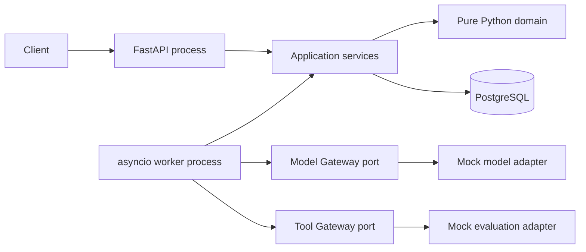

# Python-first Runtime Stack 설계

- 상태: 구현 기준안
- 작성일: 2026-09-04
- 적용 범위: Phase 0 Contract·Invariant와 Phase 1 최소 Agent Runtime

## 1. 결정

Agent Runtime Platform의 Phase 0~4는 Python 단일 애플리케이션 스택으로 구현한다.

- Python 3.13을 개발·CI·container runtime 기준으로 고정한다.
- API는 FastAPI와 Uvicorn을 사용한다.
- API contract와 설정은 Pydantic v2로 검증한다.
- PostgreSQL 접근은 SQLAlchemy 2.0 Core와 Psycopg 3 async driver를 사용한다.
- migration은 Alembic으로만 수행한다.
- API와 worker는 같은 package를 사용하지만 별도 process로 실행한다.
- dependency resolution과 lockfile은 uv로 관리한다.
- Ruff와 Pyright strict를 merge gate로 사용한다.
- pytest, pytest-asyncio, Hypothesis, Testcontainers로 검증한다.
- OpenTelemetry는 domain·DB schema에 직접 결합하지 않으며, telemetry port·exporter와 GenAI mapping 구현은 Phase 3에서 adapter로 추가한다.

`uv.lock`이 실제 artifact version의 권위이며 `pyproject.toml`에는 호환 범위를 기록한다. 2026-09-04에 확인한 안정 버전을 하한으로 사용하고, lockfile 갱신은 별도 dependency update 변경으로 수행한다.

## 2. 대안

### 2.1 Python API와 Python worker — 채택

장점:

- Agent, evaluation, MLflow, vLLM 관련 Python 생태계와 직접 연결된다.
- API와 worker가 같은 domain type, schema, error taxonomy를 공유한다.
- mock adapter에서 실제 AI adapter로 전환할 때 언어 경계가 없다.

위험:

- 느슨한 typing과 암시적 transaction 사용이 런타임 불변식을 훼손할 수 있다.
- blocking SDK를 event loop에서 호출하면 전체 worker 처리량이 감소한다.

대응:

- Pyright strict와 immutable dataclass/Pydantic contract를 적용한다.
- transaction은 Unit of Work에서만 시작·종료한다.
- blocking·CPU 작업은 별도 process 또는 Tool service로 격리한다.

### 2.2 TypeScript API와 Python worker

관리 화면과 Node 생태계에는 편리하지만 Run·Step·Error·Tool schema를 두 언어에서 동기화해야 한다. 현재 규모에서는 contract drift와 배포 단위 증가가 이점보다 크므로 채택하지 않는다.

### 2.3 Go runtime과 Python AI adapter

높은 scheduler 처리량과 작은 runtime footprint에 유리하지만 Phase 1에서는 병목 근거가 없다. queue age, CPU profile, connection saturation이 Python 목표를 지속적으로 초과할 때 별도 ADR로 평가한다.

## 3. 실행 구조



초기 배포 단위는 다음과 같다.

| Process | 시작 명령 | 책임 |
| --- | --- | --- |
| API | `uv run uvicorn agent_platform.api.app:create_app --factory` | durable Run 접수, 조회, SSE |
| Worker | `uv run python -m agent_platform.worker.main` | work item claim과 한 Run cycle 실행 |
| Migration | `uv run alembic upgrade head` | schema 변경 |
| PostgreSQL | Compose service | 실행 상태의 유일한 권위 |

API process는 model이나 tool을 직접 실행하지 않는다. Worker process만 Model/Tool port를 호출한다.

## 4. 코드 경계

```text
src/agent_platform/
├── domain/          # 상태, event, value object, 순수 transition
├── application/     # command, query, service, port, unit of work
├── adapters/        # PostgreSQL, mock model/tool, telemetry 구현
├── api/             # FastAPI route와 request/response schema
└── worker/          # polling과 Runtime Kernel 구동
```

의존 방향은 다음으로 고정한다.

```text
api/worker/adapters → application → domain
```

- `domain`은 FastAPI, Pydantic, SQLAlchemy, Psycopg를 import하지 않는다.
- `application`은 adapter 구현을 import하지 않고 `Protocol` port에만 의존한다.
- `adapters`는 application port를 구현한다.
- `api`는 HTTP schema를 application command로 변환하며 domain row를 직접 반환하지 않는다.
- `worker`는 work item ID만 받고 Unit of Work 안에서 현재 DB 상태를 다시 읽는다.
- mock AI 업무는 `examples/ai-model-release`의 설정과 adapter로 표현하며 core domain type을 추가하지 않는다.

## 5. PostgreSQL과 async 규칙

- 하나의 `AsyncSession` 또는 Psycopg connection을 동시에 여러 `asyncio.Task`가 공유하지 않는다.
- HTTP request, worker claim, worker execution transition은 각각 독립 Unit of Work를 사용한다.
- 외부 model/tool 호출 중에는 DB transaction과 row lock을 유지하지 않는다.
- 상태 projection, append-only event, 다음 work item은 같은 transaction에서 기록한다.
- Phase 1 worker는 `FOR UPDATE SKIP LOCKED`로 한 항목을 claim하고 처리한다.
- Phase 2 전까지 다중 worker, lease recovery, heartbeat, fencing을 production 보장으로 주장하지 않는다.
- serialization failure와 deadlock은 transaction 전체를 다시 실행하되 외부 effect를 포함한 transaction은 자동 재실행하지 않는다.
- 모든 timestamp는 PostgreSQL의 UTC `timestamptz`와 주입 가능한 `Clock`을 사용한다.

## 6. 타입과 오류 규칙

- ID는 `NewType` 또는 frozen value object로 구분해 Tenant ID와 Run ID 혼용을 차단한다.
- 상태는 문자열 상수가 아니라 `StrEnum`으로 정의한다.
- Domain transition은 허용되지 않은 전이에 `InvalidTransition`을 발생시키고 DB를 변경하지 않는다.
- Application error는 `code`, `message`, `retryable`, `details` 구조를 가진다.
- HTTP adapter만 error를 상태 코드로 변환한다.
- Pydantic model은 `extra="forbid"`를 기본으로 사용한다.
- 금액은 float가 아니라 `Decimal`, digest는 canonical JSON의 SHA-256을 사용한다.
- 외부 provider payload는 domain type으로 사용하지 않고 adapter에서 정규화한다.

## 7. Phase 1 vertical slice

첫 실행 경로는 다음으로 제한한다.

```text
Run 요청
→ Run·첫 Step·Event·Work Item 원자적 저장
→ 단일 worker가 Work Item claim
→ mock model이 evaluation.run_suite Tool 호출을 structured output으로 선택
→ Tool schema 검증
→ deterministic mock evaluation 실행
→ Tool 결과·Usage·Event 저장
→ Run 결과와 COMPLETED 상태 저장
```

후보 모델 metadata는 Run input에 포함된 불변 mock reference로 조회한다. `model_registry.get_candidate`, approval, benchmark, canary, promotion, rollback은 Phase 2~4에서 추가하며 Phase 1 실행 경로에는 넣지 않는다.

## 8. 테스트 전략

| 계층 | 도구 | Phase 0·1 증거 |
| --- | --- | --- |
| Domain unit | pytest | 허용·거부 상태 전이와 terminal 불변성 |
| Property | Hypothesis | 임의 event 순서가 terminal 상태를 되돌리지 않음 |
| Contract | pytest/Pydantic | mock model/tool 입출력과 extra field 거부 |
| Repository | Testcontainers PostgreSQL | Run/Event/Work Item 원자성, tenant/project scope |
| API | HTTPX ASGI transport | idempotent Run 생성·조회·SSE resume |
| Worker | pytest-asyncio | claim → model → tool → result 한 cycle |
| End-to-end | Compose/PostgreSQL | API 요청이 worker를 거쳐 terminal 결과에 도달 |

SQLite로 PostgreSQL 동작을 대체하지 않는다. `SKIP LOCKED`, JSONB, `timestamptz`, transaction conflict는 실제 PostgreSQL container에서 검증한다.

## 9. Phase 0·1 범위 밖

- 다중 worker lease·heartbeat·fencing
- retry scheduler와 dead-letter queue
- 외부 Tool exactly-once 주장
- human approval과 compensation
- long-term memory
- 복수 model provider와 failover
- 실제 OpenTelemetry exporter와 trace backend
- 실제 MLflow, vLLM, Kubernetes 연결
- `WAIT`, `CHILD_AGENT`, 병렬 fan-out

이 항목은 port와 schema 확장 가능성만 유지하고 동작을 미리 구현하지 않는다.

## 10. 완료 조건

- `uv sync --frozen`으로 동일 dependency graph를 재현한다.
- Ruff, Pyright strict, pytest가 모두 통과한다.
- Domain package에 금지한 framework import가 없다.
- 동일 idempotency key와 payload는 같은 Run ID를 반환한다.
- 동일 key와 다른 payload는 `409 IDEMPOTENCY_CONFLICT`를 반환한다.
- API 응답 전에 Run, 첫 Step, Event, Work Item이 하나의 transaction으로 commit된다.
- worker 한 cycle이 mock model과 mock evaluation Tool을 거쳐 Run을 완료한다.
- 모든 결과에서 Tenant, Project, Agent Version, Tool Version, Event sequence를 재구성할 수 있다.
- 다른 Tenant 또는 권한 없는 Project가 Run을 조회할 수 없다.

## 11. 공식 참고 자료

- [FastAPI async](https://fastapi.tiangolo.com/async/)
- [SQLAlchemy 2.0 asyncio](https://docs.sqlalchemy.org/en/20/orm/extensions/asyncio.html)
- [Psycopg concurrent operations](https://www.psycopg.org/psycopg3/docs/advanced/async.html)
- [Pydantic models](https://docs.pydantic.dev/latest/concepts/models/)
- [Alembic documentation](https://alembic.sqlalchemy.org/en/latest/)
- [uv projects](https://docs.astral.sh/uv/guides/projects/)
- [Ruff configuration](https://docs.astral.sh/ruff/configuration/)
- [Pyright configuration](https://microsoft.github.io/pyright/#/configuration)
- [Hypothesis documentation](https://hypothesis.readthedocs.io/en/latest/)
- [Testcontainers Python](https://testcontainers-python.readthedocs.io/en/latest/)
