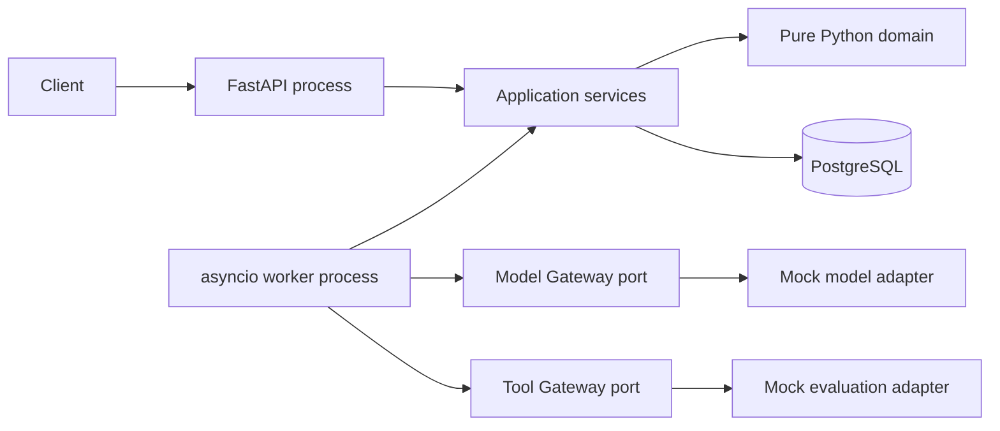

# Python-first Runtime Stack 설계

- 상태: 구현 기준안
- 작성일: 2026-09-04
- 적용 범위: Phase 0 Contract·Invariant와 Phase 1 최소 Agent Runtime

> 2026-09-13: Phase 0·1 구현을 추가했다. 현재 지원 범위·검증·설계 대비 조정은 [구현 현황](../../implementation/phase-0-1.md)을 따른다. 아래 PAAR의 Result는 설계상 기대 효과이며 모든 운영 기능의 구현 완료를 뜻하지 않는다.

## 1. 결정

Agent Runtime Platform의 Phase 0~4는 Python 단일 애플리케이션 스택으로 구현한다.

- Python 3.13을 개발·CI·container runtime 기준으로 고정한다.
- API는 FastAPI와 Uvicorn을 사용한다.
- API contract와 설정은 Pydantic v2로 검증한다.
- PostgreSQL 접근은 SQLAlchemy 2.0 Core와 Psycopg 3 async driver를 사용한다.
- migration은 Alembic으로만 수행한다.
- API와 worker는 같은 package를 사용하지만 별도 process로 실행한다.
- dependency resolution과 lockfile은 uv로 관리한다.
- Ruff와 Pyright strict를 merge gate로 사용한다.
- pytest, pytest-asyncio, Hypothesis, Testcontainers로 검증한다.
- OpenTelemetry는 domain·DB schema에 직접 결합하지 않으며, telemetry port·exporter와 GenAI mapping 구현은 Phase 3에서 adapter로 추가한다.

`uv.lock`이 실제 artifact version의 권위이며 `pyproject.toml`에는 호환 범위를 기록한다. 2026-09-04에 확인한 안정 버전을 하한으로 사용하고, lockfile 갱신은 별도 dependency update 변경으로 수행한다.

## 2. 대안

### 2.1 Python API와 Python worker — 채택

장점:

- Agent, evaluation, MLflow, vLLM 관련 Python 생태계와 직접 연결된다.
- API와 worker가 같은 domain type, schema, error taxonomy를 공유한다.
- mock adapter에서 실제 AI adapter로 전환할 때 언어 경계가 없다.

위험:

- 느슨한 typing과 암시적 transaction 사용이 런타임 불변식을 훼손할 수 있다.
- blocking SDK를 event loop에서 호출하면 전체 worker 처리량이 감소한다.

대응:

- Pyright strict와 immutable dataclass/Pydantic contract를 적용한다.
- transaction은 Unit of Work에서만 시작·종료한다.
- blocking·CPU 작업은 별도 process 또는 Tool service로 격리한다.

### 2.2 TypeScript API와 Python worker

관리 화면과 Node 생태계에는 편리하지만 Run·Step·Error·Tool schema를 두 언어에서 동기화해야 한다. 현재 규모에서는 contract drift와 배포 단위 증가가 이점보다 크므로 채택하지 않는다.

### 2.3 Go runtime과 Python AI adapter

높은 scheduler 처리량과 작은 runtime footprint에 유리하지만 Phase 1에서는 병목 근거가 없다. queue age, CPU profile, connection saturation이 Python 목표를 지속적으로 초과할 때 별도 ADR로 평가한다.

### 2.4 구현 스펙 선택 근거 (PAAR)

이 절에서는 각 선택을 `Problem → Approach → Action → Result`로 설명한다. 목적은
기술 목록 자체가 아니라, 현재 Phase 0·1에서 해결해야 하는 문제와 이후 확장에 남겨야
하는 계약을 분명히 하는 것이다.

#### Python 3.13

- **Problem:** 최소 Runtime을 먼저 만들면서도 이후 evaluation, self-hosted inference, model
  tooling과 연결해야 한다. API와 AI 실행 계층이 다른 언어이면 Run·Step·Tool contract를
  이중으로 관리하게 된다.
- **Approach:** API와 worker를 Python 단일 애플리케이션 스택으로 통일한다.
- **Action:** domain type, schema, error taxonomy, Gateway port를 하나의 `agent_platform`
  package에서 공유한다.
- **Result:** 지금은 mock adapter로 시작하고, 이후 실제 Model Gateway나 GPU inference
  adapter를 같은 contract 뒤에 연결할 수 있다.

#### FastAPI와 Uvicorn

- **Problem:** HTTP 요청은 빠르게 durable acceptance를 완료해야 하지만 model·Tool 호출은
  지연과 실패가 발생할 수 있다.
- **Approach:** API 계층은 요청 검증·Run 접수·조회·SSE만 담당하는 얇은 경계로 유지한다.
- **Action:** FastAPI로 HTTP contract를 정의하고 Uvicorn으로 API process를 실행한다.
- **Result:** API가 model 또는 Tool 실행에 묶이지 않으며, 이후 API와 worker를 독립적으로
  확장하거나 재시작할 수 있다.

#### 같은 package의 API·worker 분리

- **Problem:** 긴 model·Tool 실행을 HTTP process 안에서 수행하면 연결, timeout, 배포 장애가
  사용자 요청 처리까지 전파된다. 반대로 처음부터 여러 microservice로 나누면 계약과 배포
  단위만 늘어난다.
- **Approach:** 코드베이스와 domain은 공유하되, API와 worker의 실행 책임만 분리한다.
- **Action:** API는 Run·Step·Event·Work Item을 durable하게 기록하고, worker만 Work Item을
  claim하여 Model/Tool port를 호출한다.
- **Result:** Phase 1에서는 모듈러 모놀리스의 단순성을 유지하면서 Phase 2 이후 worker
  scaling·lease recovery를 위한 물리적 경계를 확보한다.

#### PostgreSQL 17

- **Problem:** Run projection, append-only event, queue item, idempotency record가 서로 다른
  권위를 가지면 crash 뒤 실행을 복원하거나 같은 요청을 중복 없이 처리할 수 없다.
- **Approach:** PostgreSQL을 실행 상태의 유일한 권위로 두고 broker는 나중에도 깨우기 신호로만
  취급한다.
- **Action:** Run 접수 시 Run·첫 Step·Event·Work Item을 하나의 transaction으로 기록하고,
  Phase 1 worker는 `FOR UPDATE SKIP LOCKED`로 ready work를 claim한다.
- **Result:** process 종료나 중복 전달이 있어도 DB 기록으로 현재 실행 상태를 재구성할 수 있고,
  Phase 2의 lease·fencing·outbox를 같은 권위 위에 추가할 수 있다.

#### SQLAlchemy Core와 Psycopg 3 async

- **Problem:** 이 Runtime의 핵심 위험은 일반 CRUD보다 상태 전이, row lock, transaction 경계가
  흐려지는 데 있다.
- **Approach:** persistence를 adapter에 가두고 SQL과 transaction을 명시적으로 제어한다.
- **Action:** SQLAlchemy Core로 schema와 query를 구성하고 Psycopg async driver로 PostgreSQL
  connection을 사용한다. Unit of Work 밖에서 transaction을 열지 않으며 외부 호출 중에는
  connection과 lock을 보유하지 않는다.
- **Result:** claim, state transition, event append의 원자성을 검증 가능하게 만들고, 이후
  stale worker 차단과 recovery 규칙을 구현할 기반을 확보한다.

#### Pydantic v2

- **Problem:** Run input, Agent/Tool version, provider 응답은 외부에서 들어오는 JSON이므로
  예상하지 못한 필드나 형식 오류가 실행 kernel까지 들어갈 수 있다.
- **Approach:** HTTP, 설정, registry, Tool 경계마다 명시적인 schema validation을 적용한다.
- **Action:** Pydantic model에 `extra="forbid"`를 기본으로 두고, provider payload는 adapter에서
  platform contract로 정규화한다.
- **Result:** tenant scope나 Tool argument가 우연히 확장되는 것을 막고, immutable version과
  입력·출력 contract를 재현 가능하게 유지한다.

#### Alembic migration

- **Problem:** Run과 Event는 누적되는 실행 기록이므로 schema를 임의로 변경하면 기존 실행
  데이터를 읽거나 복구하지 못할 수 있다.
- **Approach:** DB 구조 변경을 수동 작업이 아니라 versioned migration으로 관리한다.
- **Action:** schema 변경은 Alembic migration으로만 반영하고, upgrade와 downgrade를 실제
  PostgreSQL에서 검증한다.
- **Result:** 개발·CI 환경의 schema를 재현하고 migration의 가역성을 확인한다. 초기 migration의
  downgrade는 데이터를 제거하므로 운영 데이터 보존 rollback이 아니다. 운영 변경에는 별도
  expand/contract 전략과 backup·복구 검증이 필요하다.

#### `uv`와 lockfile

- **Problem:** 개발 machine, CI, container가 서로 다른 dependency version을 해석하면 같은
  Runtime code가 다른 동작을 할 수 있다.
- **Approach:** 호환 범위는 `pyproject.toml`에 두고 실제 artifact graph는 `uv.lock`으로 고정한다.
- **Action:** 개발·CI·container 준비에서 `uv sync --frozen`을 공통 재현 명령으로 사용한다.
- **Result:** dependency drift를 줄이고, 상태 전이와 async I/O 검증이 동일한 library 조합에서
  반복된다.

#### Ruff, Pyright, pytest, Hypothesis, Testcontainers

- **Problem:** Agent Runtime의 치명적 오류는 화면 오류보다 terminal state 재진입, 잘못된
  idempotency, tenant scope 누락처럼 정상 경로만으로 발견하기 어려운 contract 위반이다.
- **Approach:** 문법·타입·상태 불변식·실제 PostgreSQL 동작을 서로 다른 검증 계층으로 나눈다.
- **Action:** Ruff와 Pyright strict를 merge gate로 사용하고, pytest/Hypothesis로 state machine을,
  Testcontainers와 Compose PostgreSQL로 transaction·queue·scope를 검증한다.
- **Result:** mock happy path만 통과한 구현을 피하고, Phase 2 fault injection과 recovery test를
  신뢰할 수 있는 기초 위에서 시작한다.

#### mock Model과 mock Tool vertical slice

- **Problem:** 지금 GPU, 자체 LLM, Kubernetes를 먼저 연결하면 platform의 execution contract
  문제와 model·infrastructure 문제를 구분할 수 없다.
- **Approach:** 실제 AI 기능은 Model/Tool Gateway 뒤에 두고, 먼저 deterministic mock 실행
  경로를 완성한다.
- **Action:** candidate reference 입력 → mock model의 structured decision →
  `evaluation.run_suite:v1` mock Tool → 결과·Usage·Event 저장 경로를 구현한다.
- **Result:** 플랫폼의 durable execution 증거를 먼저 만들고, 이후 실제 provider, vLLM,
  SGLang, evaluation service를 kernel 변경 없이 교체할 수 있다.

#### Phase 0·1 범위 제한

- **Problem:** 실제 실행 부하와 failure trace가 없는 상태에서 lease, retry, approval, GPU,
  Kubernetes를 한 번에 구현하면 책임 경계와 원인 분석이 흐려진다.
- **Approach:** Phase 0·1은 최소 실행 cycle과 그 contract에 집중하고, 신뢰성·관측·governance는
  관찰된 요구를 바탕으로 다음 단계에 추가한다.
- **Action:** Phase 1은 단일 worker와 `MODEL_CALL`·`TOOL_CALL`만 지원한다. multi-worker
  lease/retry/cancel은 Phase 2, telemetry는 Phase 3, 실제 Gateway와 approval은 Phase 4로
  분리한다.
- **Result:** 플랫폼 → 실행 신뢰성 → 추적·평가 → 실제 Agent 기능 → inference·infrastructure의
  순서가 유지되며, 이후 기능이 검증된 Run contract 위에 올라간다.

## 3. 실행 구조



초기 배포 단위는 다음과 같다.

| Process | 시작 명령 | 책임 |
| --- | --- | --- |
| API | `uv run uvicorn agent_platform.api.app:create_app --factory` | durable Run 접수, 조회, SSE |
| Worker | `uv run python -m agent_platform.worker.main` | work item claim과 한 Run cycle 실행 |
| Migration | `uv run alembic upgrade head` | schema 변경 |
| PostgreSQL | Compose service | 실행 상태의 유일한 권위 |

API process는 model이나 tool을 직접 실행하지 않는다. Worker process만 Model/Tool port를 호출한다.

## 4. 코드 경계

```text
src/agent_platform/
├── domain/          # 상태, event, value object, 순수 transition
├── application/     # command, query, service, port, unit of work
├── adapters/        # PostgreSQL, mock model/tool, telemetry 구현
├── api/             # FastAPI route와 request/response schema
└── worker/          # polling과 Runtime Kernel 구동
```

의존 방향은 다음으로 고정한다.

```text
api/worker/adapters → application → domain
```

- `domain`은 FastAPI, Pydantic, SQLAlchemy, Psycopg를 import하지 않는다.
- `application`은 adapter 구현을 import하지 않고 `Protocol` port에만 의존한다.
- `adapters`는 application port를 구현한다.
- `api`는 HTTP schema를 application command로 변환하며 domain row를 직접 반환하지 않는다.
- `worker`는 work item ID만 받고 Unit of Work 안에서 현재 DB 상태를 다시 읽는다.
- mock AI 업무는 `examples/ai-model-release`의 설정과 adapter로 표현하며 core domain type을 추가하지 않는다.

## 5. PostgreSQL과 async 규칙

- 하나의 `AsyncSession` 또는 Psycopg connection을 동시에 여러 `asyncio.Task`가 공유하지 않는다.
- HTTP request, worker claim, worker execution transition은 각각 독립 Unit of Work를 사용한다.
- 외부 model/tool 호출 중에는 DB transaction과 row lock을 유지하지 않는다.
- 상태 projection, append-only event, 다음 work item은 같은 transaction에서 기록한다.
- Phase 1 worker는 `FOR UPDATE SKIP LOCKED`로 한 항목을 claim하고 처리한다.
- Phase 2 전까지 다중 worker, lease recovery, heartbeat, fencing을 production 보장으로 주장하지 않는다.
- serialization failure와 deadlock은 transaction 전체를 다시 실행하되 외부 effect를 포함한 transaction은 자동 재실행하지 않는다.
- 모든 timestamp는 PostgreSQL의 UTC `timestamptz`와 주입 가능한 `Clock`을 사용한다.

## 6. 타입과 오류 규칙

- ID는 `NewType` 또는 frozen value object로 구분해 Tenant ID와 Run ID 혼용을 차단한다.
- 상태는 문자열 상수가 아니라 `StrEnum`으로 정의한다.
- Domain transition은 허용되지 않은 전이에 `InvalidTransition`을 발생시키고 DB를 변경하지 않는다.
- Application error는 `code`, `message`, `retryable`, `details` 구조를 가진다.
- HTTP adapter만 error를 상태 코드로 변환한다.
- Pydantic model은 `extra="forbid"`를 기본으로 사용한다.
- 금액은 float가 아니라 `Decimal`, digest는 canonical JSON의 SHA-256을 사용한다.
- 외부 provider payload는 domain type으로 사용하지 않고 adapter에서 정규화한다.

## 7. Phase 1 vertical slice

첫 실행 경로는 다음으로 제한한다.

```text
Run 요청
→ Run·첫 Step·Event·Work Item 원자적 저장
→ 단일 worker가 Work Item claim
→ mock model이 evaluation.run_suite Tool 호출을 structured output으로 선택
→ Tool schema 검증
→ deterministic mock evaluation 실행
→ Tool 결과·Usage·Event 저장
→ Run 결과와 COMPLETED 상태 저장
```

후보 모델 metadata는 Run input에 포함된 불변 mock reference로 조회한다. `model_registry.get_candidate`, approval, benchmark, canary, promotion, rollback은 Phase 2~4에서 추가하며 Phase 1 실행 경로에는 넣지 않는다.

## 8. 테스트 전략

| 계층 | 도구 | Phase 0·1 증거 |
| --- | --- | --- |
| Domain unit | pytest | 허용·거부 상태 전이와 terminal 불변성 |
| Property | Hypothesis | 임의 event 순서가 terminal 상태를 되돌리지 않음 |
| Contract | pytest/Pydantic | mock model/tool 입출력과 extra field 거부 |
| Repository | Testcontainers PostgreSQL | Run/Event/Work Item 원자성, tenant/project scope |
| API | HTTPX ASGI transport | idempotent Run 생성·조회·SSE resume |
| Worker | pytest-asyncio | claim → model → tool → result 한 cycle |
| End-to-end | Compose/PostgreSQL | API 요청이 worker를 거쳐 terminal 결과에 도달 |

SQLite로 PostgreSQL 동작을 대체하지 않는다. `SKIP LOCKED`, JSONB, `timestamptz`, transaction conflict는 실제 PostgreSQL container에서 검증한다.

## 9. Phase 0·1 범위 밖

- 다중 worker lease·heartbeat·fencing
- retry scheduler와 dead-letter queue
- 외부 Tool exactly-once 주장
- human approval과 compensation
- long-term memory
- 복수 model provider와 failover
- 실제 OpenTelemetry exporter와 trace backend
- 실제 MLflow, vLLM, Kubernetes 연결
- `WAIT`, `CHILD_AGENT`, 병렬 fan-out

이 항목은 port와 schema 확장 가능성만 유지하고 동작을 미리 구현하지 않는다.

## 10. 완료 조건

- `uv sync --frozen`으로 동일 dependency graph를 재현한다.
- Ruff, Pyright strict, pytest가 모두 통과한다.
- Domain package에 금지한 framework import가 없다.
- 동일 idempotency key와 payload는 같은 Run ID를 반환한다.
- 동일 key와 다른 payload는 `409 IDEMPOTENCY_CONFLICT`를 반환한다.
- API 응답 전에 Run, 첫 Step, Event, Work Item이 하나의 transaction으로 commit된다.
- worker 한 cycle이 mock model과 mock evaluation Tool을 거쳐 Run을 완료한다.
- 모든 결과에서 Tenant, Project, Agent Version, Tool Version, Event sequence를 재구성할 수 있다.
- 다른 Tenant 또는 권한 없는 Project가 Run을 조회할 수 없다.

## 11. 공식 참고 자료

- [FastAPI async](https://fastapi.tiangolo.com/async/)
- [SQLAlchemy 2.0 asyncio](https://docs.sqlalchemy.org/en/20/orm/extensions/asyncio.html)
- [Psycopg concurrent operations](https://www.psycopg.org/psycopg3/docs/advanced/async.html)
- [Pydantic models](https://docs.pydantic.dev/latest/concepts/models/)
- [Alembic documentation](https://alembic.sqlalchemy.org/en/latest/)
- [uv projects](https://docs.astral.sh/uv/guides/projects/)
- [Ruff configuration](https://docs.astral.sh/ruff/configuration/)
- [Pyright configuration](https://microsoft.github.io/pyright/#/configuration)
- [Hypothesis documentation](https://hypothesis.readthedocs.io/en/latest/)
- [Testcontainers Python](https://testcontainers-python.readthedocs.io/en/latest/)
