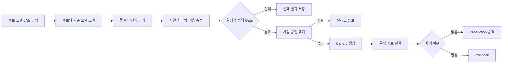

# AI Model Release Agent 예제 패키지

이 문서는 범용 Agent Runtime Platform 위에 등록할 첫 번째 AI 업무 패키지를 정의한다. 실제 MLflow, GPU benchmark, Kubernetes 배포를 실행하지 않는다.

> 현재 실행 가능한 Phase 1 예제는 [agent-version.json](agent-version.json)과 [evaluation-tool-version.json](evaluation-tool-version.json)이며, deterministic mock model → mock 평가 → 결과 저장만 수행한다. 아래 승인·복구·배포 시나리오는 이후 단계의 설계이며 현재 검증 완료한 기능이 아니다. 실행 방법과 제한은 [저장소 README](../../README.md)와 [구현 현황](../../docs/implementation/phase-0-1.md)을 따른다.

## 1. 경계

AI Model Release Agent는 플랫폼 기능이 아니라 플랫폼 위에서 실행되는 workload다.

- 플랫폼 코어는 Tenant, Project, Membership, Agent/Tool Version, Run, Step, Attempt, Approval, Policy, Usage, Audit만 소유한다.
- 이 패키지는 모델 후보, 평가 결과, benchmark 결과, canary 상태를 자기 Tool의 입출력으로만 표현한다.
- 플랫폼 코어에 `MODEL_VERSION`, `EVALUATION`, `CANARY_DEPLOYMENT` 전용 entity나 Step kind를 추가하지 않는다.
- 패키지를 제거해도 다른 Agent Definition과 Tool은 동일한 Runtime에서 실행되어야 한다.
- mock adapter를 실제 adapter로 바꿔도 Run 상태 머신과 Workflow Kernel은 변경하지 않는다.

## 2. 목표 시나리오



모델은 평가 결과를 설명하고 다음 Tool 호출을 제안할 수 있지만 품질 gate, 승인 필요 여부, 배포 권한을 결정하지 않는다. 점수 비교와 권한 판단은 versioned Policy가 결정적으로 수행한다.

## 3. Agent Definition

아래 정의는 Phase 0에서 고정할 registry contract의 기준 입력이다.

```yaml
api_version: agent.platform/v1alpha1
kind: AgentVersion
metadata:
  name: ai-model-release-agent
  version: 1
spec:
  instructions_ref: content://ai-model-release-agent/v1/instructions
  model_route: mock/release-planner-v1
  tools:
    - model_registry.get_candidate:v1
    - model_registry.get_production:v1
    - evaluation.run_suite:v1
    - inference.run_benchmark:v1
    - deployment.create_canary:v1
    - deployment.observe_canary:v1
    - deployment.promote:v1
    - deployment.rollback:v1
  execution_policy:
    max_steps: 30
    deadline_seconds: 1800
    max_input_tokens: 50000
    max_output_tokens: 12000
    max_cost_usd: "20.00"
  approval_policy:
    required_tools:
      - deployment.create_canary:v1
      - deployment.promote:v1
  compensation_policy:
    rules:
      - tool: deployment.rollback:v1
        requires_original_effect: deployment.promote:v1
        authorization_source: original_approval
        max_age_seconds: 3600
```

등록 시 플랫폼은 다음을 수행한다.

1. 모든 Tool Version이 같은 Tenant와 Project에 존재하는지 확인한다.
2. Agent Definition을 canonical JSON으로 변환하고 digest를 계산한다.
3. instructions content hash, model policy, tool schema digest, authorization policy를 함께 고정한다.
4. publish된 Agent Version은 수정하지 않고 새 version으로만 변경한다.

## 4. Run 입력과 결과

Run 입력은 모델 artifact 자체가 아니라 외부 registry가 이해하는 불변 reference다.

```json
{
  "candidate_model_ref": "mock-registry://models/release-candidate-17",
  "production_model_ref": "mock-registry://models/production-12",
  "evaluation_suite_ref": "mock-eval://suites/release-gate-v3",
  "release_environment": "staging"
}
```

성공 결과는 사용한 version과 외부 effect evidence를 포함한다.

```json
{
  "decision": "PROMOTED",
  "candidate_model_ref": "mock-registry://models/release-candidate-17",
  "policy_version": "release-policy:v3",
  "evaluation_result_ref": "mock-eval://results/eval-204",
  "benchmark_result_ref": "mock-benchmark://results/bench-118",
  "deployment_effect_ref": "mock-deployment://effects/promote-66"
}
```

원문 평가 보고서와 benchmark log는 암호화된 content store에 저장하고 Run·Step에는 reference, hash, classification만 기록한다.

## 5. Tool 계약

| Tool Version | 성격 | 입력 | 출력 | 위험 등급 |
| --- | --- | --- | --- | --- |
| `model_registry.get_candidate:v1` | read-only | model reference | artifact digest, metadata | T0 |
| `model_registry.get_production:v1` | read-only | environment | production model reference | T0 |
| `evaluation.run_suite:v1` | idempotent job | candidate, suite, effect ID | quality·safety score reference | T1 |
| `inference.run_benchmark:v1` | idempotent job | candidate, workload, effect ID | latency·throughput·cost reference | T1 |
| `deployment.create_canary:v1` | external effect | candidate, traffic %, effect ID | canary deployment reference | T2 |
| `deployment.observe_canary:v1` | read-only | canary reference, window | observed metric reference | T0 |
| `deployment.promote:v1` | external effect | canary reference, effect ID | production revision reference | T2 |
| `deployment.rollback:v1` | compensating effect | deployment reference, effect ID | restored revision reference | T2 |

모든 mock Tool은 `effect_id`를 durable unique key로 사용하고 같은 key와 같은 payload에는 같은 결과를 반환한다. 같은 key에 다른 payload가 들어오면 conflict를 반환한다.

실제 provider가 idempotency key나 결과 조회를 지원하지 않으면 Runtime은 성공 여부가 불명확한 요청을 자동 재실행하지 않고 `OUTCOME_UNKNOWN`으로 보내야 한다.

## 6. Policy와 승인

예제의 release gate는 model 응답이 아니라 다음 Policy 입력으로 계산한다.

```json
{
  "minimum_quality_score": 0.82,
  "minimum_safety_score": 0.98,
  "maximum_p95_latency_ms": 1200,
  "maximum_cost_per_million_tokens_usd": 8.5,
  "maximum_canary_error_rate": 0.01,
  "maximum_quality_regression": 0.02
}
```

- threshold 계산은 동일 입력에 동일 결론을 내는 deterministic function이다.
- model은 결과 요약과 근거 설명을 생성할 수 있지만 gate 결과를 바꿀 수 없다.
- 승인 요청은 Tool Version, 대상 환경, canonical args hash, Policy Version, 만료 시각에 묶는다.
- 승인 이후 인자, Tool Version, Policy Version이 달라지면 기존 승인을 무효화한다.
- rollback은 승인된 원본 deployment effect와 정확히 연결되고 promotion 승인에 포함된 compensation 범위 안에서만 자동 실행한다. 범위를 벗어나면 별도 승인을 요구한다.
- tenant 정지, 권한 철회, connection 폐기, emergency deny overlay는 기존 승인보다 우선한다.

## 7. Runtime 매핑

업무 흐름은 범용 Runtime primitive만 사용한다.

| 업무 동작 | 플랫폼 표현 |
| --- | --- |
| 후보·기준 모델 조회 | `TOOL_CALL` Step |
| 결과 설명과 다음 동작 제안 | `MODEL_CALL` Step |
| 평가·benchmark 실행 | `TOOL_CALL` Step과 별도 Attempt/Effect |
| release threshold 검사 | versioned Policy decision과 Run Event |
| 배포 승인 대기 | `APPROVAL` Step |
| canary 생성·승격·rollback | `TOOL_CALL` Step과 Tool Effect |
| 일시적 provider 오류 | 같은 Step 아래 새 Attempt |
| 결과가 불명확한 배포 호출 | Effect와 Step의 `OUTCOME_UNKNOWN` |

Phase 1에서는 Run에 입력된 후보 reference → mock model의 structured 판단 → 단일 mock 평가 Tool → 결과 저장의 순차 흐름만 실행한다. Run 접수 idempotency는 Phase 1에 포함하고, Phase 2에서 worker lease, retry, cancel, 외부 Tool effect idempotency, reconciliation을 붙인다. Phase 4에서 승인·canary·promotion·rollback 전체 흐름을 활성화한다.

## 8. Failure 시나리오

| 상황 | 기대 결과 |
| --- | --- |
| 같은 Run 요청을 같은 idempotency key로 100회 전송 | Run 1개, 모든 응답의 Run ID 동일 |
| mock 평가 완료 직후 worker 종료 | lease 만료 후 재개, evaluation effect 1개 |
| 승인 대기 중 API·worker 재배포 | 승인 요청과 Run 상태 유지 |
| 승인 요청 중복 전달 | 동일 approval digest에 결정 1개 |
| canary 생성 성공 후 응답 유실 | provider key 조회 후 결과 복구 |
| idempotency 미지원 deployment 응답 유실 | 자동 재호출 없이 `OUTCOME_UNKNOWN` |
| 승인과 cancel 동시 경합 | 먼저 commit된 선형화 순서에 따라 effect 분류 |
| canary quality regression 발생 | 사전 승인 범위와 원본 effect를 검증한 rollback effect 기록 |
| 다른 Tenant 또는 권한 없는 Project가 Run·approval·result reference 대입 | 접근 0건, audit 누락 0건 |

## 9. Adapter 교체 경계

| Mock | 이후 실제 adapter | 코어가 보는 계약 |
| --- | --- | --- |
| Mock Model Registry | MLflow Model Registry 등 | versioned Tool schema |
| Mock Evaluation Runner | offline evaluation service | job Tool과 result reference |
| Mock Benchmark Runner | vLLM/SGLang load test runner | job Tool과 metric reference |
| Mock Deployment Provider | Kubernetes/GitOps deployment adapter | 승인된 effect와 provider evidence |

adapter 교체 시 변경할 수 있는 것은 provider endpoint, authentication connection, timeout, rate limit, schema-compatible implementation이다. Run 상태, Step kind, 승인 모델, effect ledger는 변경하지 않는다.

## 10. 완료 기준

- 업무 전용 entity나 Step kind 없이 Agent와 Tool Version만으로 패키지를 등록할 수 있다.
- mock provider만으로 Phase별 실행 흐름을 재현할 수 있다.
- 모든 Run에서 Agent, Tool, Policy, model route version을 재구성할 수 있다.
- 배포 성격 Tool은 승인과 effect ledger를 우회할 수 없다.
- worker crash와 중복 전달 이후에도 논리 Step과 물리 Attempt가 구분된다.
- 불명확한 외부 결과가 성공 또는 일반 실패로 덮어써지지 않는다.
- Tenant와 Project 경계를 넘는 조회·실행·승인이 차단된다.
